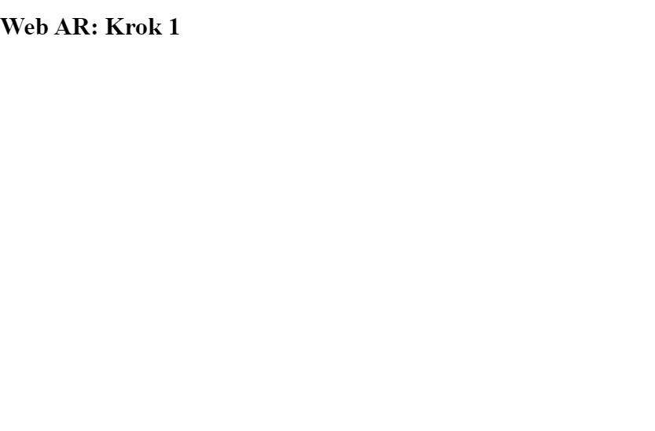
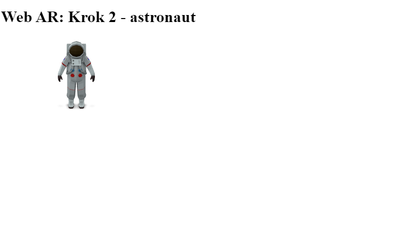
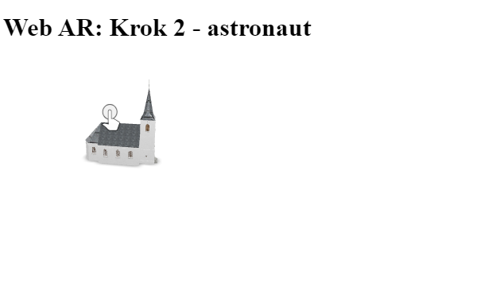
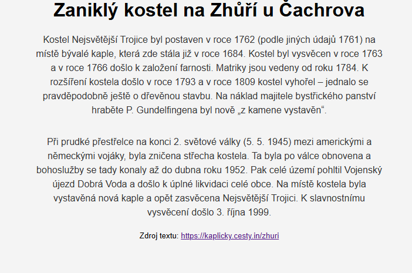
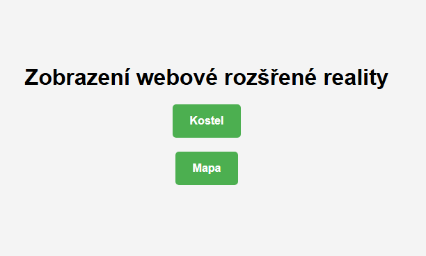
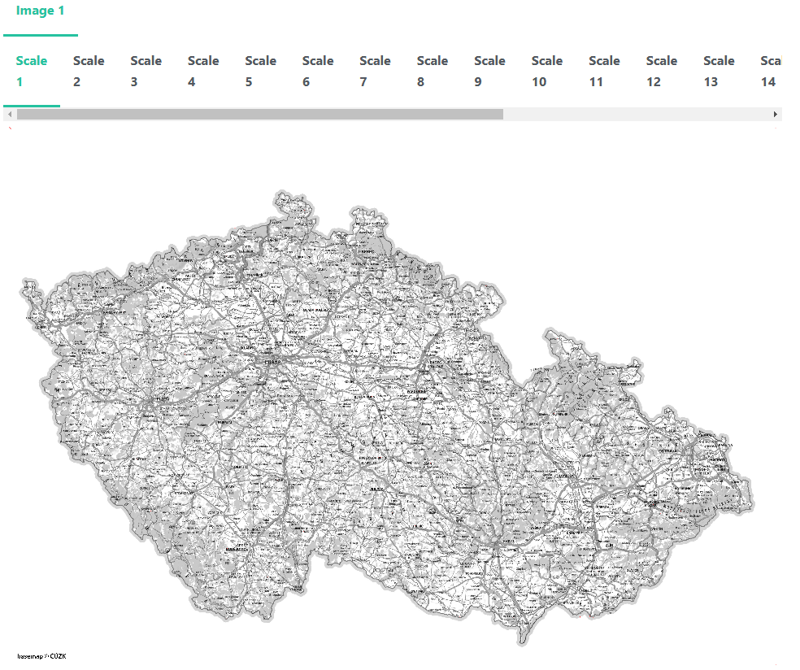

# Webová rozšířená realita

## [Prezentace](https://docs.google.com/presentation/d/1wiN_Lsa_bpyaS2wpj8AHzXRh36euV2b-tfG8Oa_SC6I/edit?usp=sharing)


## Web AR knihovny
### [Three.js](https://threejs.org/) + [AR.js](https://ar-js-org.github.io/AR.js-Docs/)
- **Popis:** AR.js je open-source knihovna postavená na Three.js a umožňuje markerless AR pomocí WebXR API

- **Funkce:**
    - podpora markerless AR (detekce rovinných povrchů pomocí WebXR)
    - renderování 3D objektů ve scéně pomocí Three.js
    - dobře zdokumentované a snadné použití
    - podporuje marker-based AR (fiduciální markery, jako jsou vzory typu Hiro nebo custom AR markery)
    - podpora image tracking (rozpoznání a sledování 2D obrazů).

- **Výhody:**
    - rychlost
    - funguje na většině moderních zařízení podporujících WebXR

- **Použití:** hodí se pro jednoduché AR projekty přímo v prohlížeči

### [A-Frame](https://aframe.io/)
- **Popis:** A-Frame je framework založený na HTML a Three.js pro tvorbu VR/AR aplikací, který podporuje WebXR

- **Funkce:**
    - jednoduchý zápis AR scény pomocí HTML značek (```<a-scene>```) 
    - podpora markerless AR pomocí WebXR

- **Výhody:**
    - snadná integrace pro vývojáře s minimálními znalostmi JavaScriptu
    - rozšiřitelné pomocí komponent
    
- **Použití:** skvělé pro rychlé prototypování a vizuálně orientované AR aplikace

### [Babylon.js](https://doc.babylonjs.com/)
- **Popis:** Babylon.js je výkonná 3D grafická knihovna, která podporuje AR přes WebXR

- **Funkce:**
    - robustní podpora WebXR pro markerless AR (detekce rovinných povrchů)
    - pokročilé renderovací možnosti pro složité scény

- **Výhody:**
    - vhodné pro složitější projekty s většími nároky na grafiku
    
- **Použití:** pro pokročilé aplikace AR a VR s pokročilým interaktivním obsahem

### [8thWall](https://www.8thwall.com/)
- **Popis:** komerční platforma pro AR aplikace, která nabízí markerless AR přímo v prohlížeči bez nutnosti použití WebXR

- **Funkce:**
    - podpora různých typů AR na široké škále zařízení (včetně iOS bez WebXR)
    - vestavěné nástroje pro detekci povrchů, odhad hloubky a přizpůsobení světelným podmínkám

- **Výhody:**
    - nejlepší výkon na trhu díky optimalizacím
    - široká podpora zařízení

- **Použití:** pro profesionální a komerční AR aplikace

### [MindAR](https://hiukim.github.io/mind-ar-js-doc/)
- **Popis:** nenáročná knihovna zaměřená na markerless AR

- **Funkce:**
    - podpora detekce 2D obrazů a povrchů
    - kompatibilní s Three.js i A-Frame

- **Výhody:**
    - nenáročnost a rychlost
    - snadno použitelná pro jednoduché AR aplikace

- **Použití:** pro vývoj aplikací s nízkými nároky na výkon

## [WebXR API](https://immersiveweb.dev/)
- WebXR (Web Extended Reality) je API pro webové prohlížeče, které umožňuje vytvářet aplikace využívající rozšířenou (**AR**) a virtuální realitu (**VR**) **přímo na webu**

- **Hlavní vlastnosti:**
    - rozšířená podpora zařízení:
        - podporuje VR headsety (např. Meta Quest, HTC Vive, Valve Index)
        - umožňuje využít AR funkce na mobilních zařízeních, která podporují detekci povrchů (např. iOS a Android)
        - funguje také na chytrých brýlích (např. HoloLens) nebo AR zařízeních

    - umístění 3D objektů ve skutečném prostoru pomocí GPS nebo detekce okolí
    - cross-platform řešení:
        - WebXR funguje na různých zařízeních a operačních systémech, pokud má uživatel moderní webový prohlížeč (Chrome, Edge, Firefox apod.)
    - jednotný přístup:
        - nabízí jednotné API pro interakci s VR i AR technologiemi, což vývojářům zjednodušuje práci

## [Model-viewer](https://modelviewer.dev/)
- ```<model-viewer>``` je webová komponenta vyvinutá Googlem, která umožňuje snadné zobrazování 3D modelů a integraci rozšířené reality (AR) do webových stránek
- je navržena tak, aby byla jednoduchá na použití a zároveň poskytovala pokročilé možnosti renderování a interakce

- tato technologie využívá WebGL pro vykreslování 3D grafiky a WebXR (pokud je dostupné) pro funkce AR, což umožňuje uživatelům snadno zobrazovat a manipulovat s 3D objekty ve webovém prohlížeči

- **Hlavní vlastnosti:**
    - Používá se jako HTML značka (podobně jako ``````), což umožňuje vložit 3D model do webové stránky bez potřeby pokročilého programování

    - ukázka: ```<model-viewer src="model.glb" alt="3D model" auto-rotate camera-controls ar></model-viewer>```
    - podpora formátu GLTF/GLB
    - interaktivní ovládání - rotace, zoom, posun
    - zobrazení modelu v mobilu i v AR

# Úloha 1 - Markerless AR

### [1. Vytvoření základní webové stránky](https://github.com/frantisekmuzik/YV3D_Web_AR/commit/a0d136780f44140ba0ed448cc353d65aa49e1fe8)


<figure markdown>
{ width="600" }
    <figcaption>Základní prázdná stránka s textem</figcaption>
</figure>

### [2. Připojení model-vieweru](https://github.com/frantisekmuzik/YV3D_Web_AR/commit/c06e6d360b79d4638ff96d34bc899ef46d65d0d4)

- ze stránky [model-vieweru](https://modelviewer.dev/) se zkopíruje *Quick Start* 

- instalace komponentu se vloží ke skriptu

- zobrazení modelu do ```body```

- výměna cesty k modelu ```src="https://modelviewer.dev/shared-assets/models/Astronaut.glb" ```

- odstranění ```enviroment image```

<figure markdown>
{ width="600" }
    <figcaption>Základní zobrazení model-viewer</figcaption>
</figure>


### [3. Výměna modelu za vlastní](https://github.com/frantisekmuzik/YV3D_Web_AR/commit/b4af3e55047cd09ce40a02315265579672ebd306)

- připravený model ve formátu *.glb* se importuje do složky *Assets* v Glitch
 
- po uploadu modelu se zkopíruje jeho URL a ve skriptu se nahradí původní model astronauta

<figure markdown>
{ width="600" }
    <figcaption>Výměna modelu</figcaption>
</figure>


### [4. Grafická úprava stránky](https://github.com/frantisekmuzik/YV3D_Web_AR/commit/30b7c5b8b67fe4da5ef3b6565bdb1c92949da99f)

- stránka se upraví tak, aby obsahovala nadpis, popis modelu a prohlížení modelu

- okno s prohlížením modelu by mělo být zvětšené (editace stylu/css)

<figure markdown>
{ width="600" }
    <figcaption>Přidání popisu</figcaption>
</figure>


# Úloha 2 - Marker AR

### [0. Vytvoření rozcestníku na stránkce - dvě tlačítka (kostel + mapa)](https://github.com/frantisekmuzik/YV3D_Web_AR/commit/a69e7fde810a729d2ee962d1189967f1c25f4703)

- vytvoření nového skripu (např. ```kostel.html```) a překopírování současného html kódu do něj

- z původního skriptu odmazat součásti body a vložit dvě tlačítka

- dále se vytvoří nový skript ```mapa.html``` se základní strukturou pro druhou úlohu

- tlačítka se upraví pomocí css

<figure markdown>
{ width="600" }
    <figcaption>Příprava menu</figcaption>
</figure>

### [1. Přidání knihoven A-Frame a MindAR do skriptu](https://github.com/frantisekmuzik/YV3D_Web_AR/commit/1bae8a4a4871b0763c8ab20d29ae1f6df52e1877)

- instalace *A-Frame Image Tracking* z odkazu <https://hiukim.github.io/mind-ar-js-doc/installation>

- vložení startovacího skriptu <https://hiukim.github.io/mind-ar-js-doc/quick-start/overview>

- nutno opravit ukončení tagu ```</a-gltf-model>```

- odstranění části připojující css skript (není potřeba)

- nyní lze otestovat zkušební vizitku z odkazu výše

### 2. Vytvoření podkladové značky pro uchycení obrazu

- z rastru mapy, která slouží jako podklad pro uchycení AR se vytvoří *Image Target* s využitím nástroje <https://hiukim.github.io/mind-ar-js-doc/tools/compile>

- **pro podkladovou mapu i vizualizované vrsty je nutné zachovat stejný rozsah (velikost) a poměr stran** - nunto připravit v GIS dopředu

- pomocí nástroje *Image Targets Compiler* se vytvořila příprava pro uchycení AR v několika měřítkách včetně zobrazení ukotvujích bodů

<figure markdown>
{ width="600" }
    <figcaption>Vytvoření marker souboru</figcaption>
</figure>

- následně se stáhne zkompilovaný soubor ```targets.mind```, který se využije v dalším kroku

- značka se nahraje do složky *Assets* do Glitche

### [3. Vložení vlastního image targetu](https://github.com/frantisekmuzik/YV3D_Web_AR/commit/333f28769e23a02463bd2f2c39d51c3ffe8b6ca6)

- nastavení cesty pro nový *Image Target* -> při vyzkoušení se přes mapu zobrazí defaultní model v AR

### [4. Pročištění kódu a vložení jedné mapové vrstvy](https://github.com/frantisekmuzik/YV3D_Web_AR/commit/eee3184771576bc85c54a51a9e55210571ba813a)

- odstranění nepotřebného kódu:
    - výměna obrázku ```img``` (mapové vrsty) v ```<a-assets>```
    - do ```<a-assets>``` vložit pouze řádek připojující mapu *"mapa-rozvoj-1830-1929-v4.png"* - ten je nahraný ve složce *Assets*
    - ```<a-camera>``` zůstane beze změny
    - do ```<a-entity>``` se vloží informace o zobrazovatelné vrstvě, opacity=1

### [5. Přidání více mapových vrstev a slideru pro jejich měnění](https://github.com/frantisekmuzik/YV3D_Web_AR/commit/b0ba841d112d3e48c54e32d217b91a3a7f75552e)

- přenastavení průhlednosti vrstvy: opacity=0

- vložení více vrstev

- přidání slideru včetně cyklu pro procházení vrstev

- úprava css stylu


???+ note "&nbsp;<span style="color:#448aff">Užitečné odkazy</span>"
    - Glitch: <https://glitch.com/>
    
    - ChatGPT: <https://chatgpt.com/>