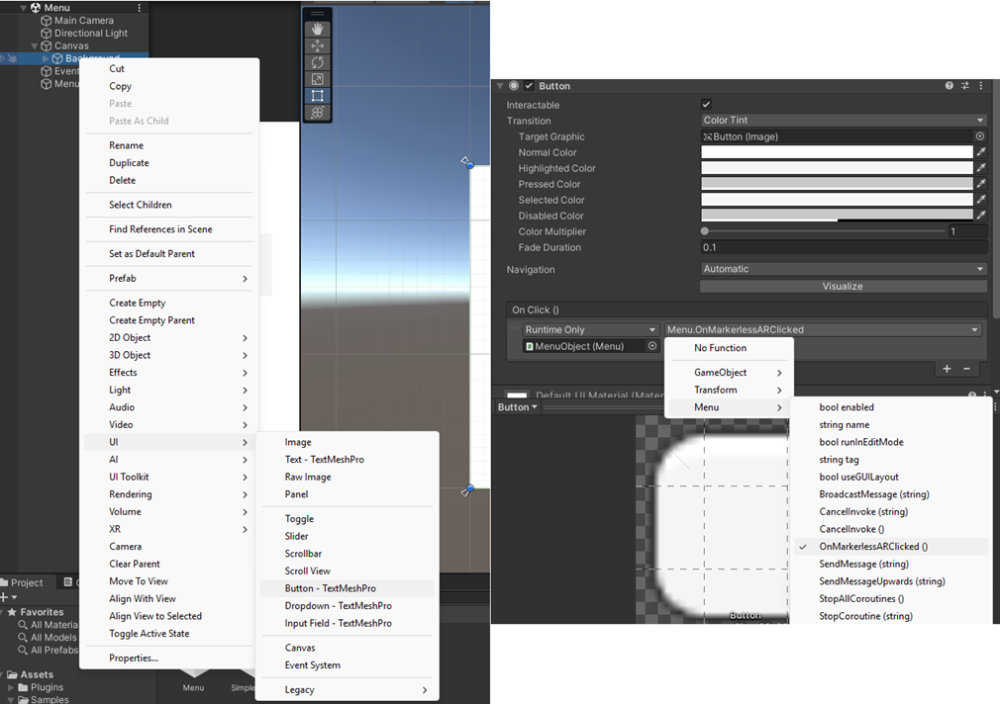
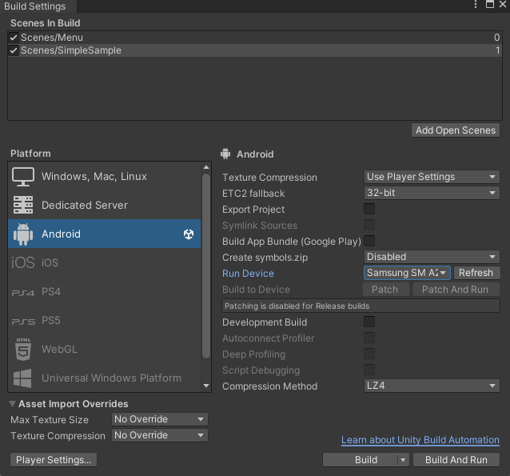
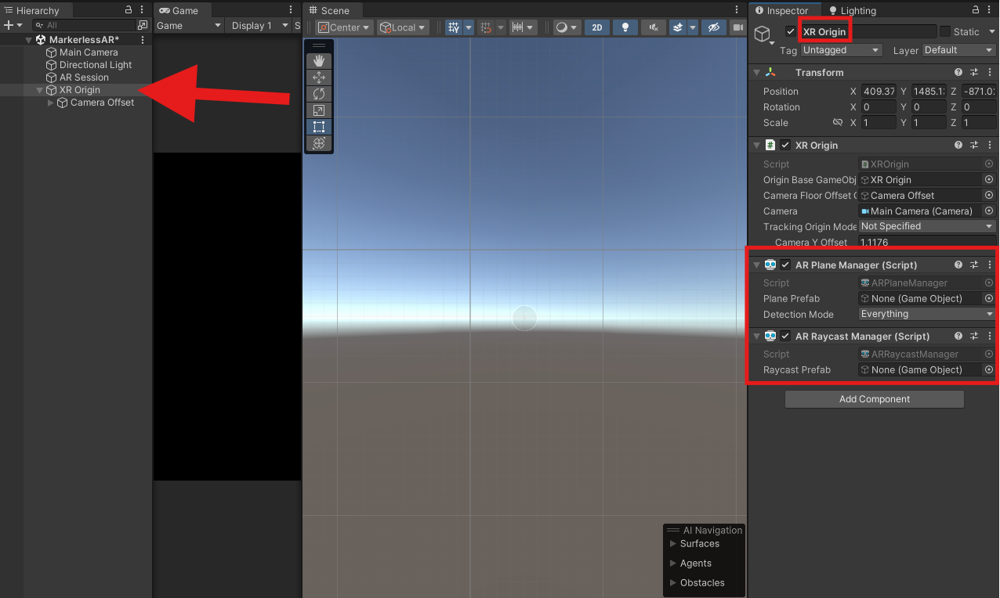
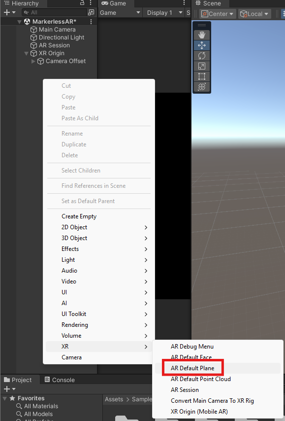
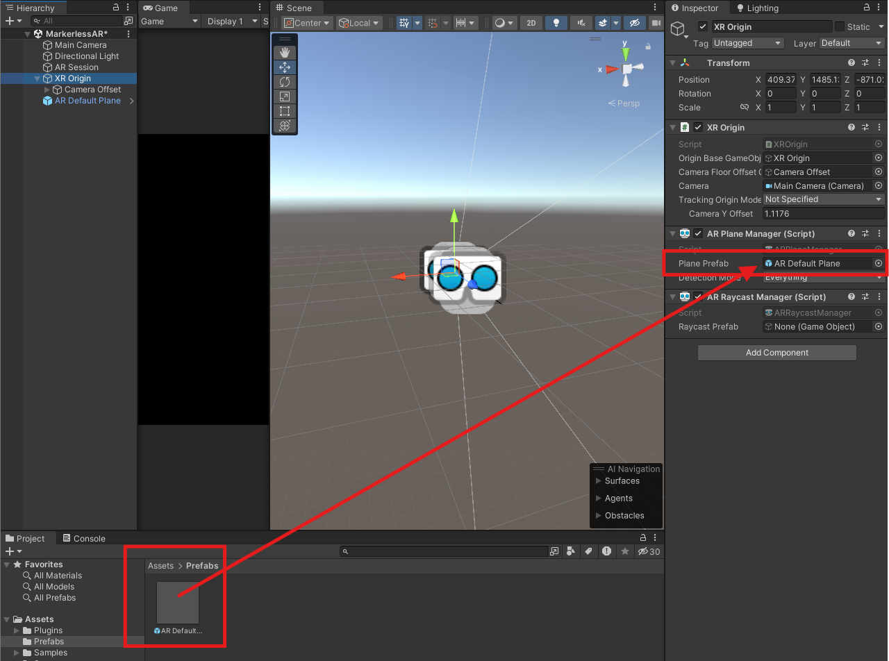
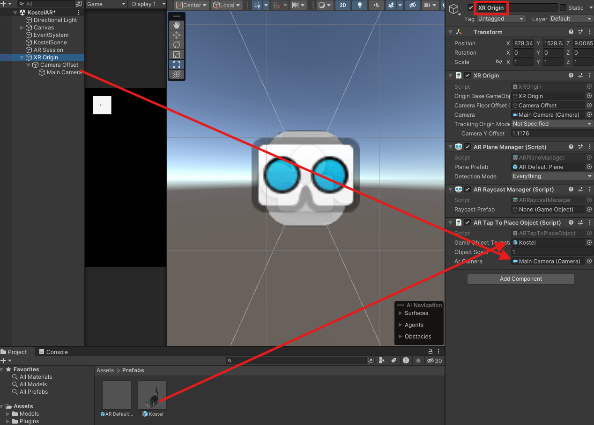
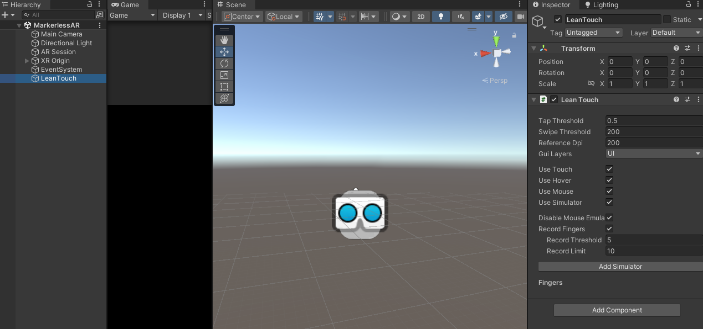
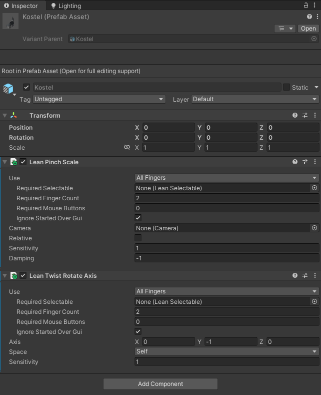
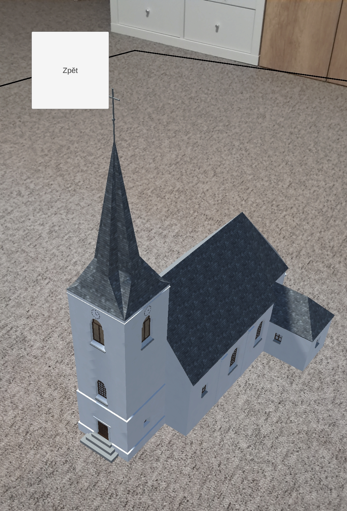

# Tvorba mobilní aplikace v Unity  

## [Prezentace](https://docs.google.com/presentation/d/1yr78qxF_FNwyZyHgeEm2Z07C7zaaVTGNtII7SNzERgI/edit?usp=sharing)

``` Použitá verze Unity 2022.3.10f ```

## Vytvoření hlavního menu aplikace a základní ovládání Unity

### 1. Import projektu

- import projektu "**YV3D_test**" a představení Unity UI

### 2. Vytvoření UI tlačítek

- v hlavním menu se vytvoří 2 tlačítka - jedno pro Markerless AR, druhé pro Location-based AR


<figure markdown>
{ width="800" }
    <figcaption>Přidání tlačítka</figcaption>
</figure>

- **základní metody pro Unity C#**
    - **Awake()**
        - popis: Volá se jako první při inicializaci skriptu (před funkcí Start). Používá se pro inicializaci, která nezávisí na jiných skriptech.
        - spuštění: Ihned po přidání skriptu do scény nebo při aktivaci objektu.
    - **Start()**
        - popis: Volá se jednou na začátku životního cyklu objektu, těsně před prvním voláním funkce Update. Vhodné pro inicializaci závislou na ostatních objektech.
        - spuštění: Po dokončení všech Awake() metod ve scéně.
    - **Update()**
        - popis: Volá se každým snímkem (frame). Používá se pro logiku, která se má provádět průběžně, např. kontrola vstupů od uživatele nebo pohyb objektů.
        - spuštění: V každém snímku během běhu aplikace.
    - **OnEnable()/OnDisable()**
        - popis: Volá se, když je objekt nebo skript povolen (enabled)/zakázán (disabled). 
        - spuštění: Při aktivaci/deaktivaci objektu nebo komponenty.

- výpis zprávy do konzole při stisknutí tlačítka
```c#
    // Markerless AR tlačítko
    public void OnMarkerlessARClicked()
    {
        Debug.Log("Tabletop AR button has been clicked");
    }
```
- změna scény tlačítkem

```c#
    // Markerless AR tlačítko
    public void OnMarkerlessARClicked()
    {
        Debug.Log("Tabletop AR button has been clicked");
        SceneManager.LoadScene("SimpleSample");
    }
```

- přiřazení skriptu pro ovládání *Menu* do nového game objectu *MenuComponent*

- zpětné tlačítko  *SimpleSample* -> *Menu*

- **Poznámka:** pro fungování přepínání scén v telefonu je nutné dané scény vložit do aktivních scén v *Build Settings* a po zapnutí aplikace se zapne první scéna v pořadí
 
<figure markdown>
{ width="600" }
    <figcaption>Změna cílové platformy</figcaption>
</figure>

## Markerless AR

- kontrola nastavení AR v *Build Setting* a *Player Settings*

- kontrola nainstalovaných pluginů

- vytvoření nové scény **MarkerlessAR**

- přidání game objectů
    - *AR Session* - řídí běh AR
    - *XR Origin* - spravuje pozici a orientaci AR objektů v prostoru

- do *XR Origin* se přidají komponenty
    - *AR Plane Manager* - umožňuje detekovat rovné plochy (např. stoly, podlahy)
    - *AR Raycast Manager* - umožňuje interakci s reálným světem, např. pokládání objektů na detekované plochy

<figure markdown>
{ width="800" }
    <figcaption>Přidání AR game objectů</figcaption>
</figure>

- vytvoření materiálu pro skenování ploch -> nový komponent *AR Default Plane*

<figure markdown>
{ width="400" }
    <figcaption>Vytvoření detekce ploch</figcaption>
</figure>

- vytvoření složky Prefabs, do které se přetažením vloží *AR Default Plane*

- připnutí *AR Default Plane* do komponentu *AR Plane Manager*

<figure markdown>
{ width="800" }
    <figcaption>Nastavení detekování ploch</figcaption>
</figure>


- vytvoření nebo přidání 3D modelu do složky Models

- přidání skriptu zobrazující model *ARTapToPlaceObject*

- smazat původní gameobject *MainCamera*

<figure markdown>
{ width="800" }
    <figcaption>Nastavení AR scény</figcaption>
</figure>

- přidání ovládání AR modelu pomocí pluginu [Lean Touch](https://assetstore.unity.com/packages/tools/input-management/lean-touch-30111)

- přidání *EventSystem* do scény pro možnost zprovoznění dotykového ovládání

- přidání LeanTouch gameobjectu pro ovládání dotyku

<figure markdown>
{ width="800" }
    <figcaption>Nastavení dotykového ovládání</figcaption>
</figure>

- vložení komponent *Lean Pinch Scale* a *Lean Twist Rotate Axis* do modelu kostela - v Inspectoru

- nastavení parametrů dle obrázku níže

<figure markdown>
{ width="400" }
    <figcaption>Parametry dotykového ovládání</figcaption>
</figure>

- **výsledek:** 

<figure markdown>
{ width="400" }
    <figcaption>Výsledná AR vizualizace v aplikaci</figcaption>
</figure>

## Location-based AR

- využití Immersal SDK: <https://immersal.com/>

- postup: <https://developers.immersal.com/docs/unitysdk/tutorial/>