Model terénu pro 3D tisk je možné vygenerovat řadou způsobů (GIS, webové aplikace). Problém nastává při přidání povrchových vrstev (využití ploch, budovy, silnice, vodstvo). 3D modely, které využívají naše vlastní data je možné pro 3D tisk připravit pomocí desktopových nástrojů, které jsou pro nové uživatele náročné k použití. 

Takové modely lze připravit například následujícím způsobem: **GIS** (prostorová data, terén) :material-arrow-right: **CityEngine** (generování 3D modelů budov, úprava dat) :material-arrow-right: **3D modelovací software** - SketchUp/Blender (finalizace modelů, doplnění legendy či popisu) :material-arrow-right: **slicer** (příprava pro 3D tisk).

<figure markdown>
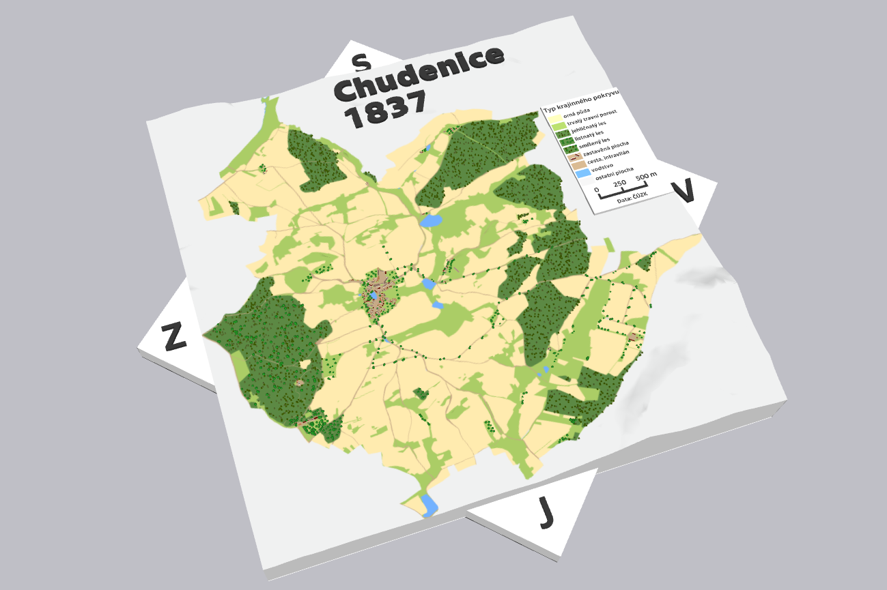{ width="600" }
    <figcaption>Ukázka 3D mapy vytvořené pomocí vlastních dat v GIS a CityEngine</figcaption>
</figure>

!!! note "&nbsp;<span>Ukázky pokročilejších nástrojů</span>"
    - CityEngine: <https://www.arcdata.cz/cs-cz/produkty/arcgis/arcgis-cityengine/uvod>

    - BlenderGIS: <https://github.com/domlysz/BlenderGIS>

## [Map2Model](https://map2model.com/)

Díky volně dostupným webovým aplikacím je možné velmi jednoduše a dostupně připravit 3D model terénu včetně povrchových vrstev přímo ve webovém prohlížeči, např. pomocí nástroje [Map2Model](https://map2model.com/). V tomto nástroji lze připravit 3D mapu přímo pro tisk vytvořenou na základě dat [OpenStreetMap](https://www.openstreetmap.org/). Jednotlivé mapové vrstvy lze upravovat, částečně filtrovat či vyčlenit do samostatné vrstvy pro oddělený tisk (vodstvo).

<figure markdown>
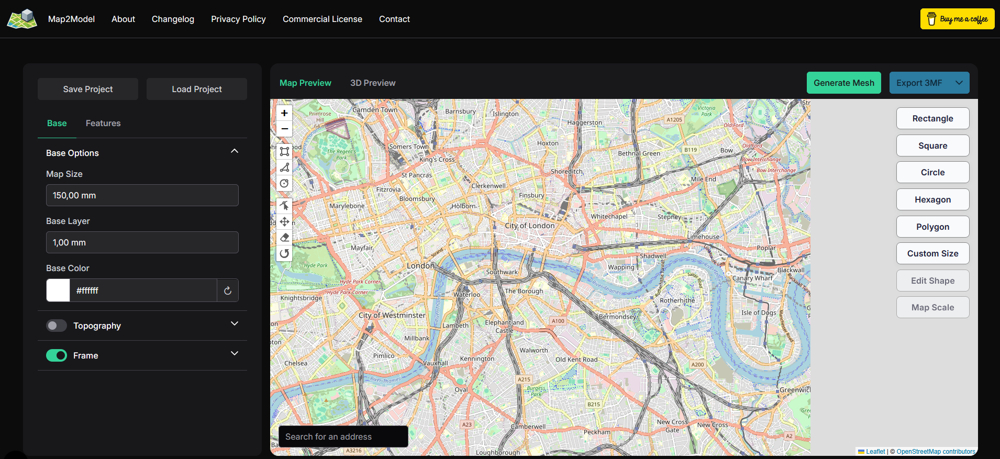{ width="1000" }
    <figcaption>Úvodní stránka Map2Model    </figcaption>
</figure>

### 1) Výběr území

V prvním kroku si vybereme území pro tisk. Při výběru území je nutné brát ohled na **rozměry a úroveň generalizace finálního produktu**. Je tedy vhodné vybrat menší území a po vytvoření náhledu tisku ve sliceru velikost výběru upravit podle potřeby.

Nabízí se několik možností tvaru území, přičemž je možné libovolně měnit velikost území dle našich požadavků a limitů **velikosti tiskové podložky**.

<figure markdown>
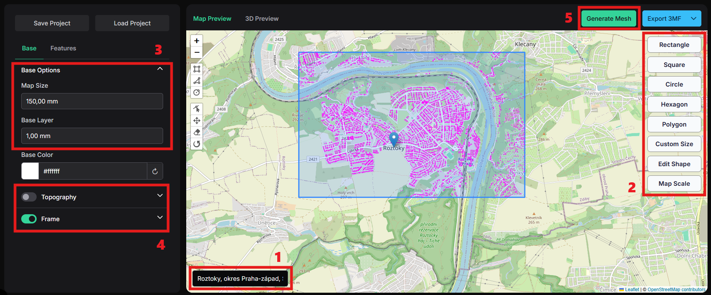{ width="1000" }
    <figcaption>Výběr území</figcaption>
</figure>

- Nejprve vybereme území v mapě - buď vyplněním adresy nebo ručně.

- Následně si určímě tvar území a nakreslíme jeho výřez. Ten je možné měnit buď tlačítkem *Edit Shape* nebo nástroji v levé části mapového okna. Pokud potřebujeme mapu v daném měřítku, lze jej zadat tlačítkem *Map Scale*.

- Po výběru území si můžeme nastavit parametrem *Map Size* délku nejdelší strany mapového výřezu. Zároveň lze nastavit výšku podkladu *Base Layer*.

- V základním nastavení se mapa vygeneruje bez terénu. Ten je však možné přidat zaškrtnutím *Topography*. Po rozkliknutí celé nabídky se zobrazí možnosti pro další úpravu terénu. Obdobně můžeme přidat obrysový rámeček *Frame*. 

- Pro náhled nad daty klikneme na tlačítko *Generate* a *3D Preview*.


<figure markdown>
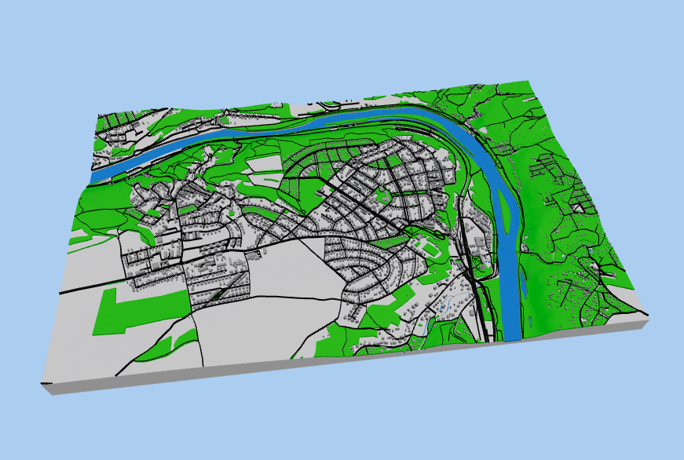{ width="600" }
    <figcaption>Náhled na vytvořený terén</figcaption>
</figure>

!!! tip "&nbsp;<span>Uložení projektu</span>"
    Projekt je možné uložit do formátu .json. Díky tomu se můžeme k návrhu kdykoliv vrátit a editovat jej dle potřeby.

    <figure markdown>
    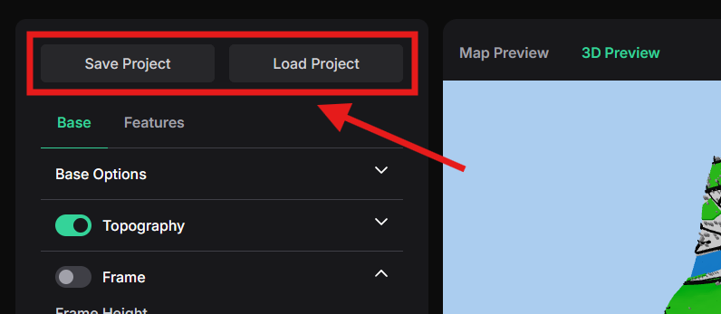{ width="400" }
        
    </figure>

### 2) Úprava parametrů modelu
Pokud chceme upravit více parametrů 3D modelu - jako například výběr vrstev, filtraci různých typů budov/cest nebo nastavení výšky jednotlivých vrstev, tak je potřeba překliknout do záložky *Features* vlevo nahoře.

<figure markdown>
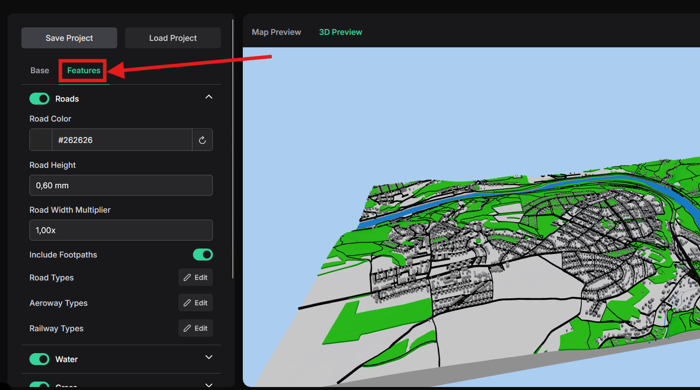{ width="800" }
    <figcaption>Práce v záložce Features</figcaption>
</figure>

Pro příklad můžeme provést následující úpravy:

- Filtraci pěších cesty v nabídce *Roads* - *Include Footpaths* a snížení výšky cest na 0,4 mm

- Nastavení výšky vrstvy travnatých ploch *Grass* na 0,2 mm a výběr budov pouze s výměrou větší než 30 m^2^.

- Odebrání vrstev *Sand* a *Pier*

Do mapy je možné přidat také vlastní cestu pomocí importu souboru .gpx. Takovou cestu získáme exportem trasy například z [OpenStreetMap](https://www.openstreetmap.org), [GraphHopper](https://graphhopper.com/maps/) či [Mapy.com](https://mapy.com).

<figure markdown>
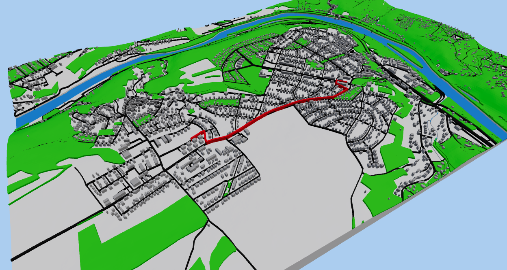{ width="800" }
    <figcaption>Upravený 3D model s přidanou trasou</figcaption>
</figure>

### 3) Rozdělení vrstvy vodstva

Pro širší možnosti barevného tisku nebo pro tisk barevného modelu na jednobarevné tiskárně (rozdělením do více částí) je možné vyčlenit vrstvu vodstva do samostatné vrstvy. Ta bude následně vytisknuta zvlášť a model se na ni po tisku přilepí. Toto řešení není vhodné pro hornaté oblasti, neboť by výsledný model nebyl příliš pěkný z důvodu velkých rozdílů ve výšce terénu a spodní vrstvy. 

Oddělení vrstvy se nastaví v nabídce *Water* - *Cut Out Water*. Pro vytvoření podkladové vrstvy vodstva je potřeba zaškrtnout *Water Base*.

<figure markdown>
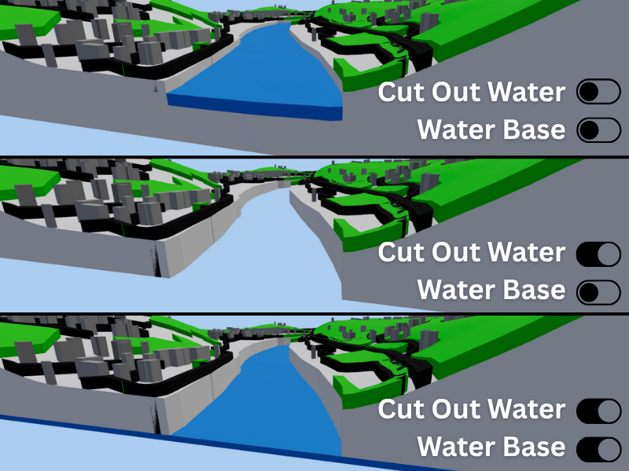{ width="600" }
    <figcaption>Nastavení zobrazení vodstva</figcaption>
</figure>

### 4) Stažení modelu a import do sliceru

Pokud jsme s modelem spokojeni, pak klikneme na tlačítko *Generate Mesh* a následovně na *Export 3mf*. V tuto chvíli si také můžeme projekt uložit do .json.

Stažený soubor .3mf otevřeme pomocí PrusaSliceru. Zobrazí se vyskakovací okno upozorňující na detekování objektu obsahujícího více částí - tlačítkem *Ano* povolíme hromadný import. Při volbě *Ne* by se všechny vrstvy načetly samostatně, čímž bychom přišli o vzájemné prostorové vztahy.

<figure markdown>
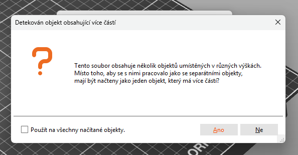{ width="600" }
    <figcaption>Upozornění při načítání více samostatných objektů</figcaption>
</figure>

Vložené objekty by měly být rozděleny na samostatné části, které můžeme přejmenovat pro lepší orientaci.

<figure markdown>
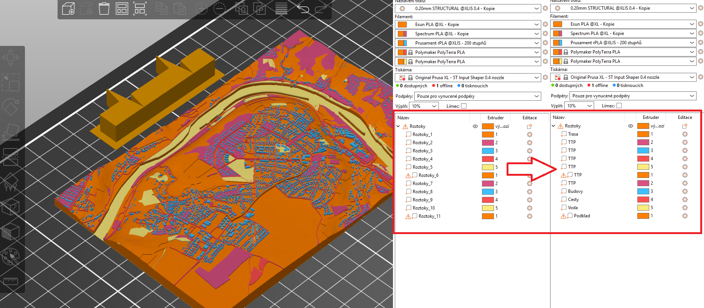{ width="1000" }
    <figcaption>Zobrazení modelu v PrusaSliceru a přejmenovanání jednotlivých objektů</figcaption>
</figure>

### 5) Nastavení ve sliceru

Pro optimální tisk je potřeba přenastavit/upravit některá nastavení PrusaSliceru. V našem případě se jedná o změnu barev, určení filamentu, přidání obrysu a nastavení čistící věže.

Kvůli barevnému tisku musíme mít nastavenou tiskárnu *Original Prusa XL - 5T Input Shaper 0.4 nozzle*. Správně zvolenou tiskárnu si ověříme tak, že v hlavní nabídce vidíme 5 různých filamentů namísto jednoho (základní nastavení).

**Změna barev** proběhne v záložce *Tiskárny* volbou daného extruderu (tiskové hlavy). Nastavení barev neovlivní výslednou barvu tisku (to vždy musíme vyřešit vhodně zvoleným filamentem), ale pro práci ve sliceru získáme lepší představu o vizuální podobě výsledného modelu. Jednotlivé plochy musíme barevně rozdělit tak, abychom se vešli do barevného limitu přístroje (5 barev pro Prusa XL).

Na tomto příkladu si vybereme barvy následovně:

| Extruder     | Povrch                         | Barva                        |
| ----------- | ------------------------------------ | ------------------------------------ |
| 1      | budovy | tmavě šedá                       |
| 2       | voda | modrá                    |
| 3    | podklad, travnaté plochy, pole, ostatní | bílá                      |
| 4       | cesty | černá                        |
| 5    | trasa | červená                        |


<figure markdown>
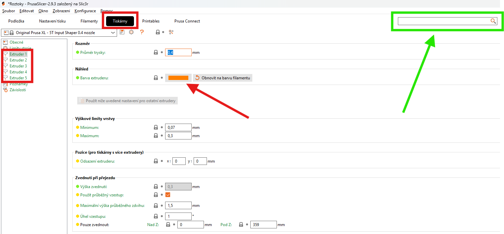{ width="800" }
    <figcaption>Změna barev a nastavní extruderu</figcaption>
</figure>

<figure markdown>
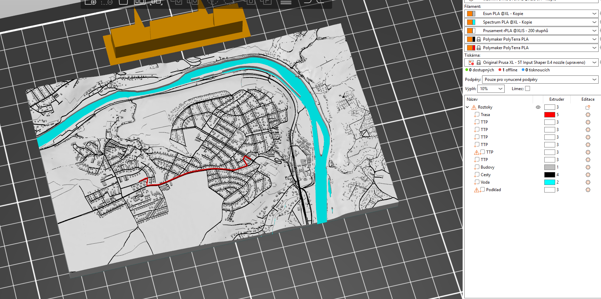{ width="800" }
    <figcaption>Výsledný barevný model</figcaption>
</figure>

Dále musíme určit vhodné **filamenty** a jejich parametry. V základním nastavení se zobrazují pouze některé profily filamentů (liší se například výrobcem). V ideálním případě je vhodné začít s předem definovanými profily filamentů, tedy například *Prusament PLA*. 

Vybraný profil je možné editovat dle libosti (doporučeno až po porozumění základů 3D tisku). Nejčastěji upravovanými parametry jsou teplota či [retrakce](https://help.prusa3d.com/cs/article/stringovani-a-odkapavani-filamentu_1805).

!!! tip "&nbsp;<span>Tip</span>"
    Základní profily filamentů nelze přepsat. Pro jejich editaci je potřeba vytvořit kopii, kterou pak lze upravovat dle potřeby.

    Rozsáhlejší návod pro nastavení parametrů filamentu: <https://youtu.be/Wxh3fsE_4Do?si=YGSaU8TLZua7pJ7I>

<figure markdown>
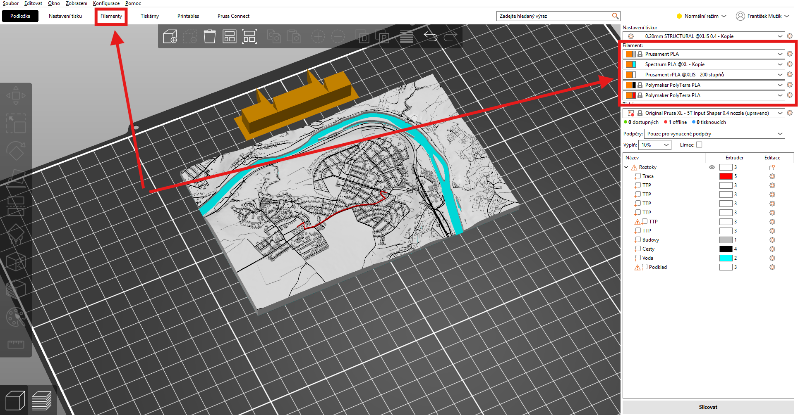{ width="1000" }
    <figcaption>Nastavení filamentů v PrusaSlicer</figcaption>
</figure>

Pro zkvalitnění tisku můžeme v PrusaSliceru zapnout některá další nastavení. V tomto případě se bude jednat o **obrys** a **čistící věž**. Pro zlepšení přilnavosti je možné zapnout také límec. 

Obrys je tištěná linka ohraničující všechny modely na tiskové podložce. Obrys je tištěn vždy jako první a jeho hlavním učelem je stabilizovat průtok nataveného filamentu tryskou. Nastavíme jej v záložce *Nastavení tisku* :material-arrow-right: *Obrys a límec*. Přepíšeme počet smyček na 1. Ve stejné záložce je možné měnit parametry i pro límec. 

<figure markdown>
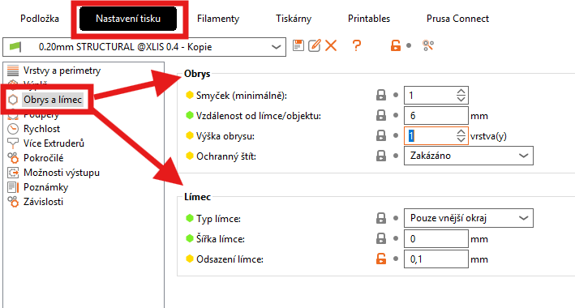{ width="600" }
    <figcaption>Nastavení obrysu a límce</figcaption>
</figure>

Čistící věž je na tiskové podložce kvůli tomu, aby bylo možno zajistit ostré přechody barev a stabilní posun filamentu i po změně barvy. Využívá se tedy v případě multimateriálového (=barevného) tisku. Její nastavení nalezneme opět v záložce *Nastavení tisku* :material-arrow-right: *Více extruderů*.

<figure markdown>
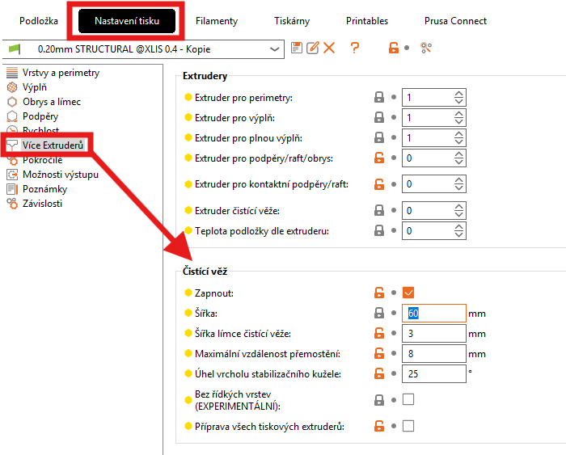{ width="600" }
    <figcaption>Nastavení čistící věže</figcaption>
</figure>

Po slicování si můžeme zkontrolovat přidání nových parametrů tisku.

<figure markdown>
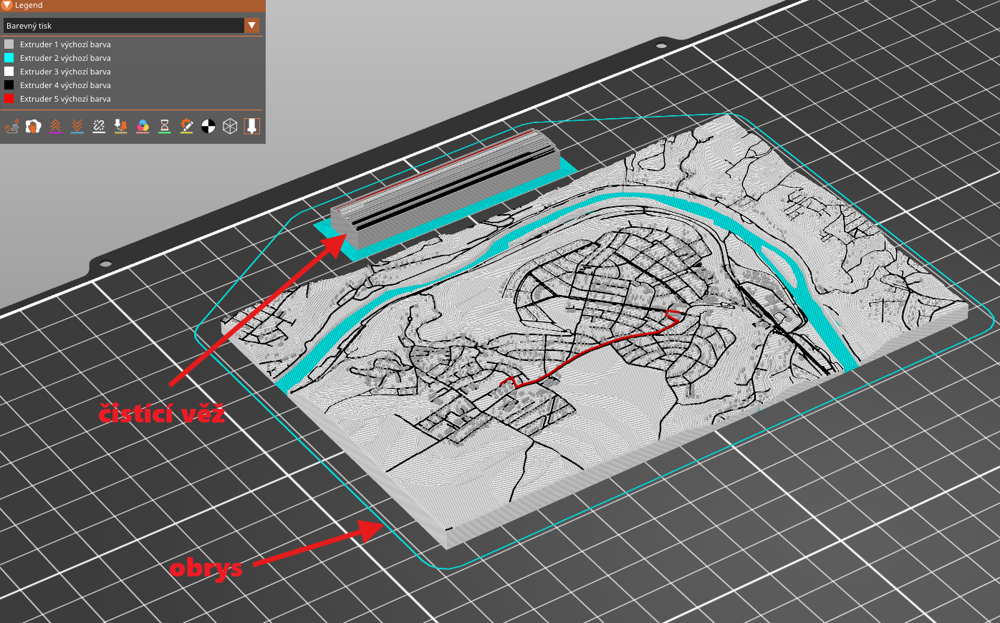{ width="800" }
    <figcaption>Ukázka obrysu a čistící věže po vyslicování modelu</figcaption>
</figure>

### 6) Export modelu pro tisk

Jestliže máme model připravený pro 3D tisk, existují dvě možnosti, jak jej exportovat do tiskárny. 

- Wifi tisk, pro který je potřeba spárovat konkrétní 3D tiskárnu s PrusaSlicerem na počítaci.

- Export ve formátu G-code, který do tiskárny přesuneme pomocí přenosného USB flash disku.

Po vyslicování modelu se zobrazí buď jedna nebo obě možnosti (dle předchozího párování s tiskárnou). V tomto případě využijeme možnosti *Exportovat G-code*. Soubor přesuneme na přenosný USB flash disk a následně jej vložíme do tiskárny manuálně.

<figure markdown>
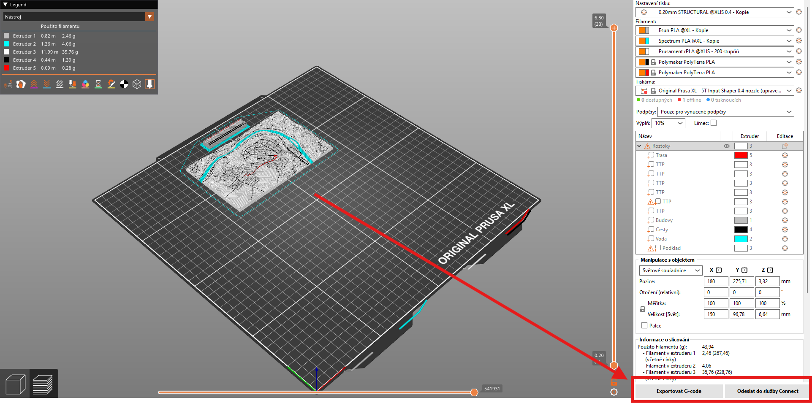{ width="1000" }
    <figcaption>Export modelu pro tisk</figcaption>
</figure>

!!! warning "&nbsp;<span>Odevzdání úlohy</span>"
    Připravený G-code ve tvaru **"prijmeni_jmeno_misto.bgcode"** odešlete na mail ```frantisek.muzik@fsv.cvut.cz``` do **úterý 21.10.2025** s informací, zda máte zájem o tisk fyzického modelu. 

!!! note "&nbsp;<span>Další zajímavé informace</span>"
    - 7 věcí, které ovlivňují kvalitu tisku: <https://josefprusa.cz/7-veci-ktere-ovlivnuji-kvalitu-tisku/>

    - Obrys a límec: <https://help.prusa3d.com/cs/article/obrys-a-limec_133969>

    - Rafts, Skirts and Brims!: <https://www.simplify3d.com/resources/articles/rafts-skirts-and-brims/>

    - Čistící věž: <https://help.prusa3d.com/cs/article/chytra-cistici-vez_125010>
