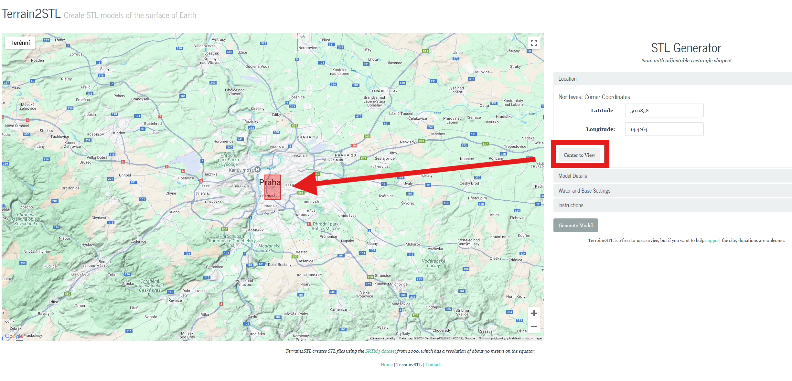
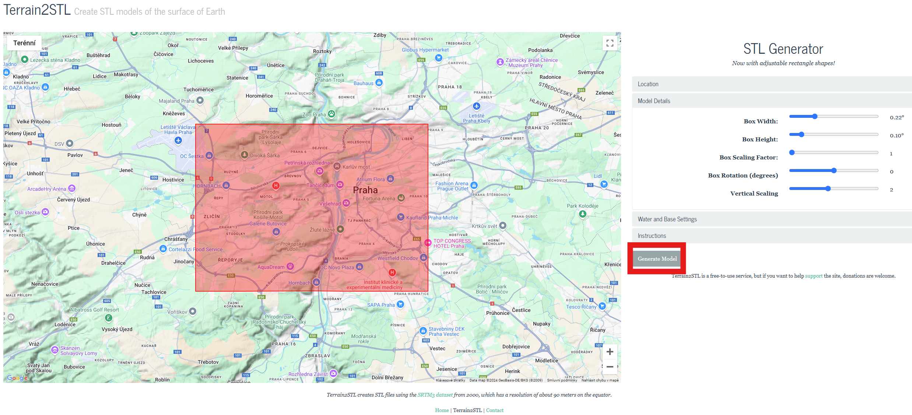
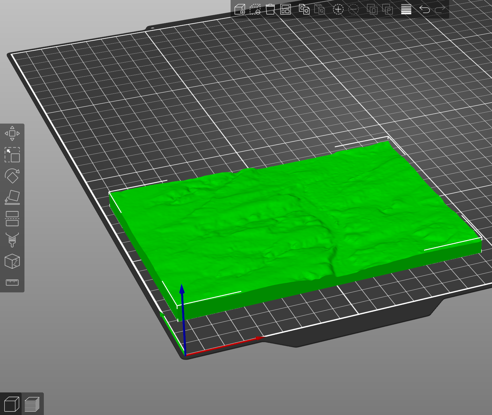
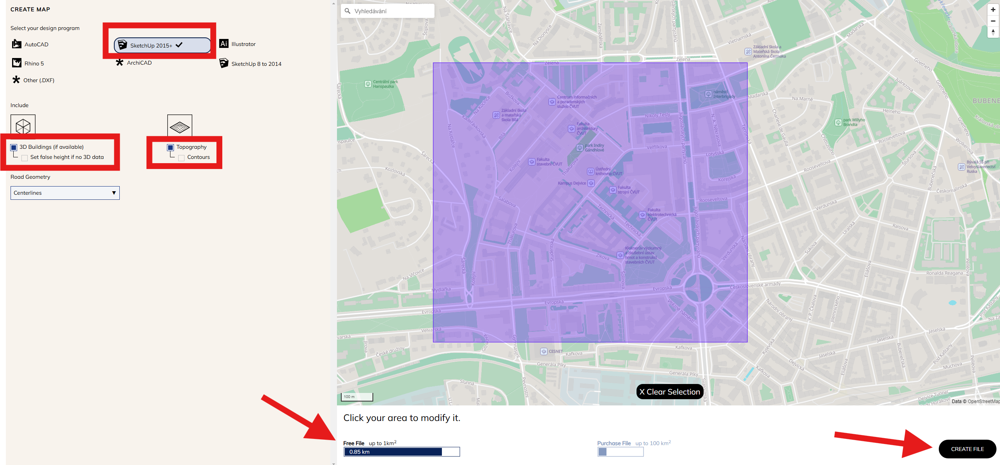
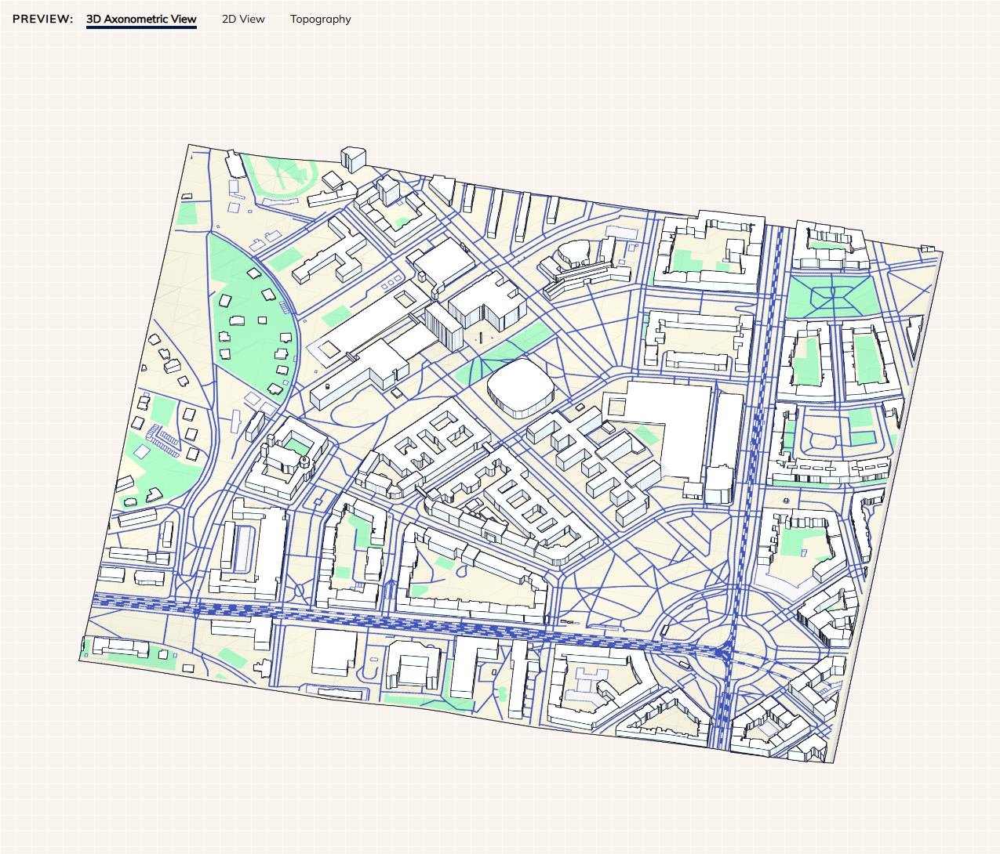
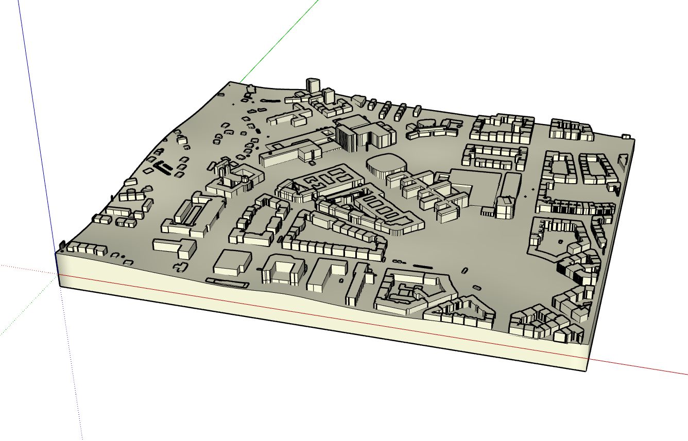

## [Prezentace](https://docs.google.com/presentation/d/1j0gdW9ONigroddMcLznmx1z6jKLW65LkUTh5pNDGOTg/edit?usp=sharing)

## [Terrain2STL](https://jthatch.com/Terrain2STL/)
- tvorba jednoduchého modelu povrchu z Google Map
- kresba obdélníku s využitím nástrojů aplikace

<figure markdown>
{ width="800" }
    <figcaption>Nástroj Terrain2STL</figcaption>
</figure>

- pomocí nástrojů lze nastavit velikost obdélníku, jeho natočení či hodnotu vynásobení výšky pro vytvoření zajímavěji formovaného terénu
- následně je nutné model vygenerovat a stáhnout jej v zipu, který obsahuje .stl soubor

<figure markdown>
{ width="800" }
    <figcaption>Výběr území a úprava parametrů</figcaption>
</figure>

- model se rozbalí a otevře v Prusa Sliceru: *Soubor* - *Importovat* - *Importovat STL*

<figure markdown>
{ width="600" }
    <figcaption>Vygenerovaný model v Prusa Slicer</figcaption>
</figure>

## [CAD Mapper](https://cadmapper.com/)
- tisk terénu z Open Street Map -> více funkcí oproti Terrain2STL
- na webu najít tlačítko *Create File*
- v mapě vybrat nakreslením obdélníku zájmovou lokalitu (zdarma do 1 km2)
- výsledný model se bude exportovat do SketchUpu 2015+ včetně 3D budov a topografie

<figure markdown>
{ width="800" }
    <figcaption>Prostředí CAD Mapper</figcaption>
</figure>

- model lze následně prohlížet v různých pohledech před stažením

<figure markdown>
{ width="600" }
    <figcaption>Model vygenerovaný pomocí CAD Mapper</figcaption>
</figure>

- model se extrahuje a otevře ve SketchUpu
- ve SketchUpu je nutné doinstalovat plugin *Eneroth Terrain Volume*, ten se vyhledá skrze *Extensions* - *Extension Warehouse* 
- před použitím pluginu se odstraní nepotřebné vrstvy (tagy) modelu (vše kromě *Untagged*, *topography* a *buildings*)
- následně se vybere kliknutím terén a srze záložku *Extensions* se spustí *Eneroth Terrain Volume*
- výšku terénu a budov je následně možné měnit *funkcí Push/Pull*

<figure markdown>
{ width="600" }
    <figcaption>Zobrzení části terénu ve SketchUpu</figcaption>
</figure>

- po úpravě je model připravený k exportu do formátu .stl a k nahrání do Prusa Sliceru

???+ note "&nbsp;Užitečné odkazy"
    - How to print maps, terrains and landscapes on a 3D printer: <https://blog.prusa3d.com/how-to-print-maps-terrains-and-landscapes-on-a-3d-printer_29117/>
    
    - 3D Printing and Photogrammetry: <https://www.pix-pro.com/blog/3d-printing>

    - How to 3D Print GIS Data from Global Mapper: <https://www.bluemarblegeo.com/blog/how-to-3d-print-gis-data-from-global-mapper/>

    - 3D tisk UPOL: <https://www.geoinformatics.upol.cz/veda-vyzkum/3d-tisk/>

    - How to Design 3D Population Maps Using Tinkercad: <https://www.tinkercad.com/projects/How-to-Design-3D-Population-Maps-Using-Tinkercad>

    - RealityCapture 3D print: <https://www.capturingreality.com/manufacturing-3Dprinting>
    
    - How To Use RealityScan: <https://youtu.be/HVkvHZCmVjU?si=L629gyrV5xjFkjMu>

    - model totální stanice: <https://cults3d.com/en/3d-model/art/leica-total-station-ms60-kit-to-assemble>
