## Doporučená literatura

- Stříteský, O. a kol. (2021): [Základy 3D tisku s Josefem Průšou](https://is.muni.cz/el/ped/jaro2021/TI9009/111101390/zaklady-3d-tisku.pdf)

- Mlejnek, T. (2026): [Trojrozměrná rekonstrukce zaniklého kostela sv. Martina v obci Brtníky metodou 3D tisku](https://dspace.cvut.cz/entities/publication/e218161d-41c5-472f-b033-72b9dc9c0a7c). České vysoké učení technické v Praze.

- Rase, W.D. (2002): [Physical Models of GIS by Rapid Prototyping](https://www.isprs.org/proceedings/XXXIV/part4/pdfpapers/237.pdf). Symposium on Geospatial Theory, Processing and Applications. Ottawa.

- Mužík, F. (2025): Augmented Reality as a 3D Land Cover Visualisation Technique. Stavební Obzor - Civil Engineering Journal, 34(1), 29-41. <https://doi.org/10.14311/CEJ.2025.01.0003>

---------

## Příprava 3D modelu mapy

Model terénu pro 3D tisk je možné vygenerovat řadou způsobů (GIS, webové aplikace). Problém nastává při přidání povrchových vrstev (využití ploch, budovy, silnice, vodstvo). 3D modely, které využívají naše vlastní data, je možné pro 3D tisk připravit pomocí desktopových nástrojů, které jsou pro nové uživatele náročné k použití. 

Takové modely lze připravit například následujícím způsobem: **GIS** (prostorová data, terén) :material-arrow-right: **CityEngine** (generování 3D modelů budov, úprava dat) :material-arrow-right: **3D modelovací software** - SketchUp/Blender (finalizace modelů, doplnění legendy či popisu) :material-arrow-right: **slicer** (příprava pro 3D tisk).

<figure markdown>
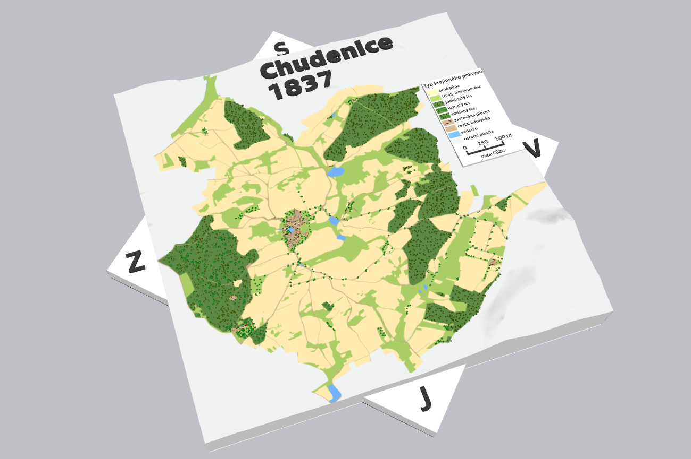{ width="600" }
    <figcaption>Ukázka 3D mapy vytvořené pomocí vlastních dat v GIS a CityEngine</figcaption>
</figure>

!!! note "&nbsp;<span>Ukázky pokročilejších nástrojů</span>"
    - Qgis2threejs: <https://plugins.qgis.org/plugins/Qgis2threejs/>

    - CityEngine: <https://www.arcdata.cz/cs-cz/produkty/arcgis/arcgis-cityengine/uvod>

    - BlenderGIS: <https://github.com/domlysz/BlenderGIS>

## [Mini Skyline](https://miniskyline.com)

Díky volně dostupným webovým aplikacím je možné velmi jednoduše a dostupně připravit 3D model terénu včetně povrchových vrstev přímo ve webovém prohlížeči, např. pomocí nástroje [Mini Skyline](https://miniskyline.com). V tomto nástroji lze připravit 3D mapu přímo pro tisk vytvořenou na základě dat [OpenStreetMap](https://www.openstreetmap.org/). Jednotlivé mapové vrstvy lze upravovat, částečně filtrovat či vyčlenit do samostatné vrstvy pro oddělený tisk (vodstvo).

### 1) Popis uživatelského rozhraní

Při otevření mapy v nástroji Mini Skyline se zobrazí základní umístění výřezu. Zároveň je zvolené předkonfigurované nastavení parametrů pro výběr a tisk jednotlivých vrstev mapy. 

V horní liště je dostupný výběr nástrojů. Po vybrání nástroje se níže zobrazí jeho podrobné nastavení. V této sekci bude probíhat převážná část úprav parametrů mapy pro tisk. Vlevo nahoře uvnitř mapového okna je možné přepnout 2D a 3D pohled. V pravém dolním rohu obrazovky lze změnit jazyk a barevný profil stránky.

Uprostřed mapového okna je zobrazený výřez vybraného území. Ten lze měnit pomocí nabídky v horní části mapového okna. Detaily parametrů, posun a otočení výřezu je možné změnit nabídkou v dolní části mapy.

<figure markdown>
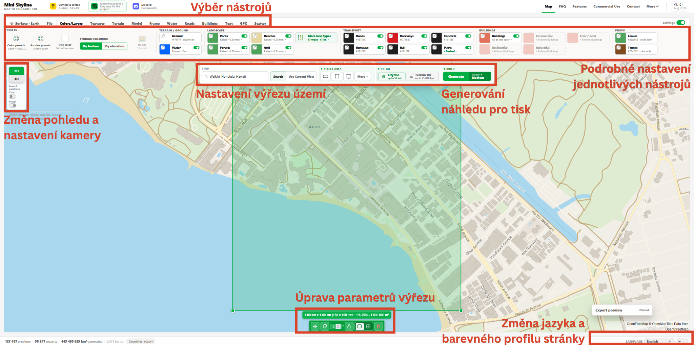{ width="1000" }
    <figcaption>Úvodní stránka Mini Skyline</figcaption>
</figure>

**Základní popis jednotlivých záložek:**

- **Surface** slouží pro výběr planety. V tomto případě necháme zvolenou Zemi (*Earth*).

- **File** umožňuje uložení projektu, díky čemuž se lze vrátit k rozpracované mapě.

- **Color/Layers** nabízí výběr mapových vrstev pro tisk včetně nastavení jejich symbologie.

- **Terrain** určuje styl terénu (reliéf či plochu). Je možné určit zvýšení terénu nebo zobrazení vrstevnic.

- Velikost výsledné mapy nastavíme v záložce **Model**.

- **Frame** dovoluje přidání rámečku kolem mapy.

- Nastavení vody a jejího vykreslení lze upravit v **Water**.

- **Roads** umožňuje editaci a správu cest a silnic. 

- Změnu parametrů týkajících se budov nastavíme uvnitř **Buildings**.

- **Text** slouží pro přidání textových popisků do modelu.

- Vlastní trasu (například exportem z chytrých hodinek) můžeme přidat pomocí záložky **GPX**.

- **Scatter** přidává možnost pokrytí vybraných ploch stromy či kameny. Můžeme takto vytvořit například les. Nicméně přidáním dalších prvků se může rapidně zvýšit datový objem výsledného modelu.


### 2) Výběr území

<figure markdown>
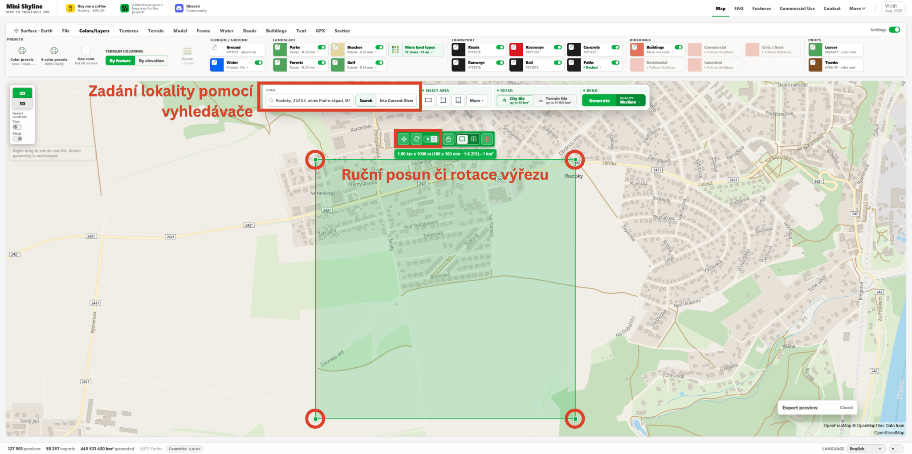{ width="1000" }
    <figcaption>Určení lokality výřezu</figcaption>
</figure>

Území pro tisk můžeme vybrat buď posunem zeleného výřezu, nebo zadáním místa s názvem území do vyhledávače. Velikost výřezu je potřeba nastavit úměrně možnostem tiskové plochy a míře detailu (tedy měřítku). Pro naše možnosti nastavíme maximální **velikost výřezu na 200 mm** (*Maximum width*) uvnitř nabídky *Model*. V nabídce je možné určit přímo maximální rozměry modelu (tzn. delší stranu obdélníka) nebo vytvořit výřez přímo v zadaném měřítku.

Při určování rozměrů výsledného modelu musíme myslet na limity tiskárny (tisková plocha, průměr trysky).

!!! tip "&nbsp;<span>Tip</span>"
    Pro velikost výřezu **200 mm** je doporučené mezní měřítko **1 : 20 000**. V menších měřítkách se již mohou ztrácet detaily (např. cesty či budovy) kvůli přesnosti tisku. Každý model však vyžaduje specifické nastavení míry detailu.

**Další parametry vlastností modelu:**

- *Model base* = výška podkladové vrstvy. Můžeme ponechat v základním nastavení.

- *Lithopane Road Shine Through* slouží pro tisk speciálním [Lithophane](https://www.filament-pm.cz/clanek/hura-na-mesic-16) filamentem, který umožňuje prosvěcování prvků světlem. Necháme vypnuto.

<figure markdown>
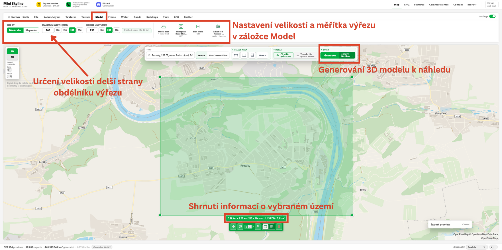{ width="1000" }
    <figcaption>Zadání velikosti modelu</figcaption>
</figure>

### 3) Vygenerování modelu a pokročilá editace

Pokud jsme spokojeni s nastavením výřezu mapy, můžeme vygenerovat náhled 3D modelu tlačítkem *Generate* v prostřední nabídce v horní části mapy. Generování by mělo trvat maximálně několik desítek sekund. Po úspěšném vygenerování modelu se zobrazí panel *Export preview*, ve kterém lze zjistit rozměry modelu, počet trojúhelníků či budov. 

Kliknutím na tlačítko *Advanced details* se přesuneme do pokročilé editace 3D modelu. Jedná se o kompletně novou obrazovku s detailnějšími možnostmi týkajícími se úprav modelu.

V první záložce **Buildings** je možné doplnit budovy nebo upravit jednotlivé vygenerované modely budov. Budovu vybereme levým tlačítkem myši, načež ji můžeme posunout, smazat, otočit či zvětšit. Obdobně funguje záložka **Roads**, ve které se upravují silnice a cesty. Pokud nejsme spokojeni s podkladovým terénem, můžeme jej upravit ve třetí záložce **Elevation**. Dále je možné ručně přidat stromy (**Trees**) nebo změnit plochy nakreslením nového pokrytí krajiny (**Paint**).

Jestliže jsme se změnami spokojeni, můžeme je potvrdit vpravo dole tlačítkem *Apply*. V opačném případě zvolíme možnost *Discard draft*. Pokročilou editaci vypneme tlačítkem *Close* vpravo nahoře.

<figure markdown>
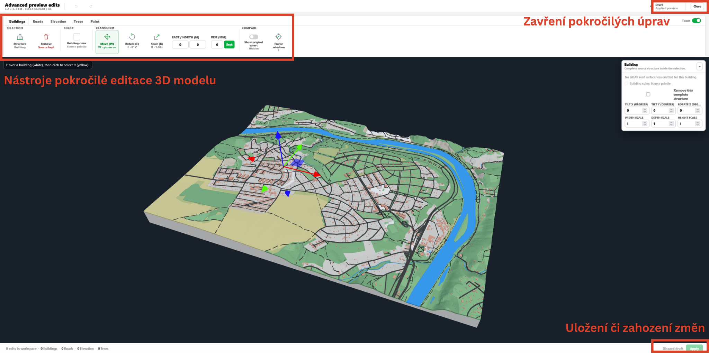{ width="1000" }
    <figcaption>Pokročilá editace 3D modelu</figcaption>
</figure>

### 4) Editace mapových vrstev

Mapu můžeme vyexportovat v základním nastavení. Nicméně aplikace Mini Skyline nabízí poměrně rozsáhlé možnosti editace. Projdeme si tedy ty užitečnější z nich.

!!! tip "&nbsp;<span>Tip</span>"
    Je dobré projekt pravidelně ukládat, abychom nepřišli o dosavadní práci. Uložení se skrývá v záložce **File** &rarr; *Save Workspace*.

Nejprve se přesuneme do záložky **Colors/Layers**. Uvnitř se nachází seznam vrstev získaných z Open Street Map. Mapovým vrstvám můžeme měnit barvu (bohužel to neovlivní barvu ve výsledném .3mf souboru, jen se změní barva ve vizualizaci 3D modelu). Dále je můžeme vypnout a zapnout podle potřeby. Důležitým nastavením však je zapuštění vrstvy v terénu (*Flush*) či naopak její vyvýšení (*Raised*). Díky správnému nastavení vznikne přehledná mapová vizualizace.

!!! tip "&nbsp;<span>Tip</span>"
    Při vymýšlení barevné palety musíme brát do úvahy maximální počet barev, který je naše 3D tiskárna schopna vytisknout. Při použití Prusa XL se jedná o **5 barev.**

V tomto kroku provedeme například vyvýšení lesních ploch (*Forests*) na 0,4 mm. Možné je také podle potřeby upravit vodní plochy (*Water*), které v případě potřeby kompletně vypnout. Pokud bychom chtěli změnit barevnou paletu modelu, můžeme si barvu buď libovolně přeměnit podle svých preferencí, nebo využít přednastavené barevné palety. Ty se ukrývají vlevo pod tlačítkem *Color presets*. Barevné palety můžeme ukládat, načítat z disku nebo využít uživatelské (*Browse community*).

<figure markdown>
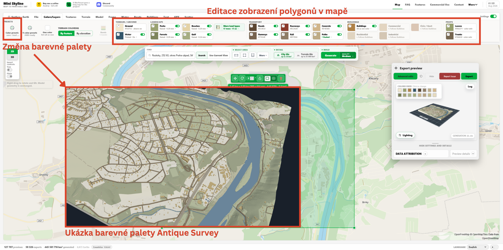{ width="1000" }
    <figcaption>Změna barevné palety a editace vrstev</figcaption>
</figure>

Může se stát, že model obsahuje příliš mnoho cest, které je dobré profiltrovat. Pomocí pokročilé editace (*Advanced edits*) můžeme výběrem odhalit atributy cest. Nepotřebné cesty lze vypnout. Případně je možné změnit šířku vybraných cest, tedy lze zvětšit šířku hlavních silnic, pokud to uznáme za vhodné. Pokud jsme nastavili menší měřítko, může být dobré zvětšit také budovy v záložce **Buildings** funkcí *Height multiplier* na 2x zvětšení.

### 5) Export modelu

Jestliže jsme s úpravami spokojeni, je na čase model vyexportovat. To provedeme tlačítkem *Export* uvnitř *Export preview*.

Před exportem bychom se měli ujistit, že model neobsahuje malé prvky, které by nedokázala 3D tiskárna vytisknout (například velmi malé budovy).

<figure markdown>
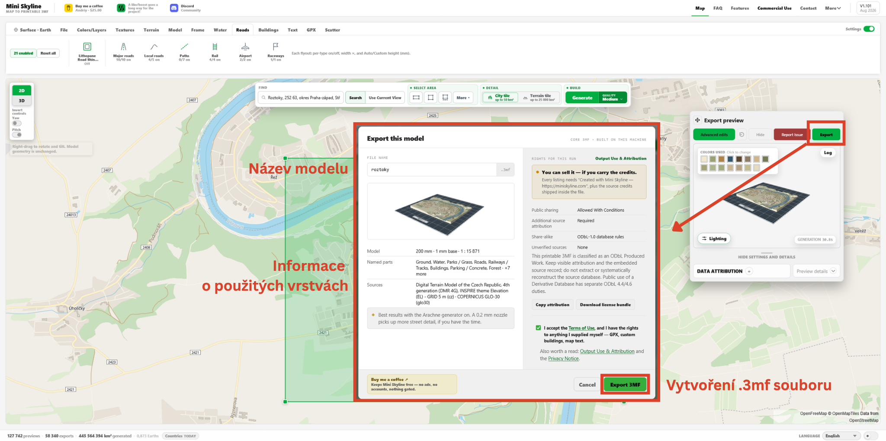{ width="1000" }
    <figcaption>Export modelu do formátu .3mf</figcaption>
</figure>


### 6) Práce v PrusaSliceru

Stažený soubor .3mf otevřeme pomocí PrusaSliceru. Zobrazí se vyskakovací okno upozorňující na detekování objektu obsahujícího více částí - tlačítkem *Ano* povolíme hromadný import. Při volbě *Ne* by se všechny vrstvy načetly samostatně, čímž bychom přišli o vzájemné prostorové vztahy.

<figure markdown>
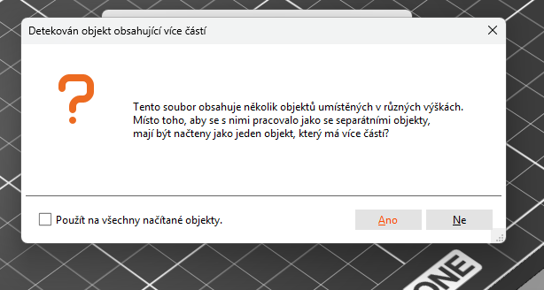{ width="600" }
    <figcaption>Upozornění při načítání více samostatných objektů</figcaption>
</figure>

Pro optimální tisk je potřeba přenastavit/upravit některá nastavení PrusaSliceru. V našem případě se jedná o změnu barev, určení filamentu, přidání obrysu a nastavení čisticí věže.

Kvůli barevnému tisku musíme mít nastavenou tiskárnu Original Prusa XL - 5T Input Shaper 0.4 nozzle. Správně zvolenou tiskárnu si ověříme tak, že v hlavní nabídce vidíme 5 různých filamentů namísto jednoho (základní nastavení).

**Změna barev** proběhne v záložce Tiskárny volbou daného extruderu (tiskové hlavy). Nastavení barev neovlivní výslednou barvu tisku (to vždy musíme vyřešit vhodně zvoleným filamentem), ale pro práci ve sliceru získáme lepší představu o vizuální podobě výsledného modelu. Jednotlivé plochy musíme barevně rozdělit tak, abychom se vešli do barevného limitu přístroje (5 barev pro Prusa XL).

**Na tomto příkladu si vybereme barvy následovně:**

| Extruder     | Povrch                         | Barva                        |
| ----------- | ------------------------------------ | ------------------------------------ |
| 1      | budovy | béžová                      |
| 2       | voda | modrá                    |
| 3    | silnice a cesty | hnědá                      |
| 4       | podklad, zástavba, pole, ostatní | světle béžová                     |
| 5    | lesy, louky, parky | zelená                       |

<figure markdown>
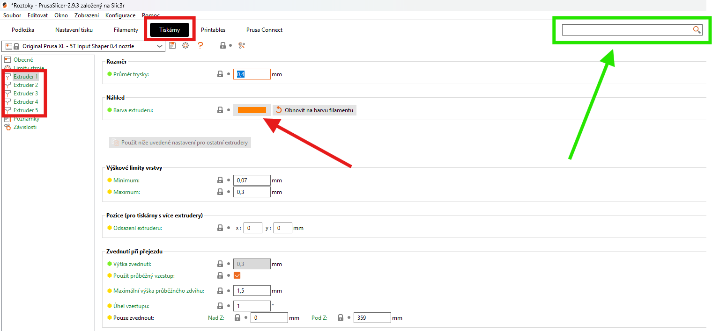{ width="800" }
    <figcaption>Změna barev a nastavení extruderu</figcaption>
</figure>

<figure markdown>
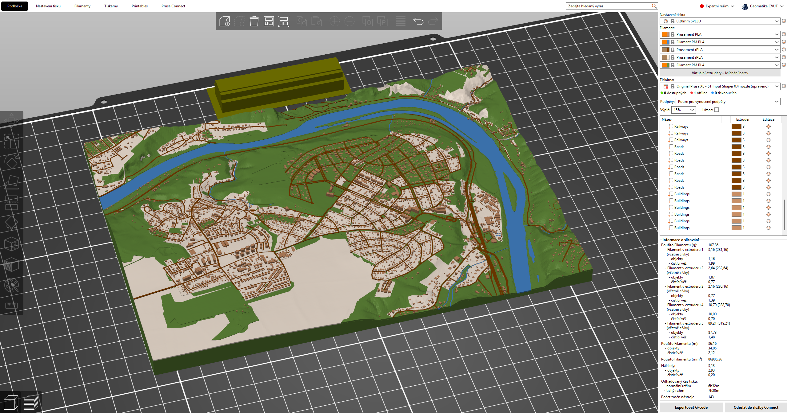{ width="1000" }
    <figcaption>Výsledný barevný model</figcaption>
</figure>

Dále musíme určit vhodné **filamenty** a jejich parametry. V základním nastavení se zobrazují pouze některé profily filamentů (liší se například výrobcem). V ideálním případě je vhodné začít s předem definovanými profily filamentů, tedy například Prusament PLA.

Vybraný profil je možné editovat dle libosti (doporučeno až po porozumění základů 3D tisku). Nejčastěji upravovanými parametry jsou teplota či [retrakce](https://help.prusa3d.com/cs/article/stringovani-a-odkapavani-filamentu_1805). 

!!! tip "&nbsp;<span>Tip</span>"
    Základní profily filamentů nelze přepsat. Pro jejich editaci je potřeba vytvořit kopii, kterou pak lze upravovat dle potřeby.

    Rozsáhlejší návod pro nastavení parametrů filamentu: <https://youtu.be/Wxh3fsE_4Do?si=YGSaU8TLZua7pJ7I>

Pro zkvalitnění tisku můžeme v PrusaSliceru zapnout některá další nastavení. V tomto případě se bude jednat o **obrys** a **čisticí věž**. Pro zlepšení přilnavosti je možné zapnout také **límec**.

Obrys je tištěná linka ohraničující všechny modely na tiskové podložce. Obrys je tištěn vždy jako první a jeho hlavním účelem je stabilizovat průtok nataveného filamentu tryskou. Nastavíme jej v záložce *Nastavení tisku* &rarr; *Obrys a límec*. Přepíšeme počet smyček na 1. Ve stejné záložce je možné měnit parametry i pro límec. 

<figure markdown>
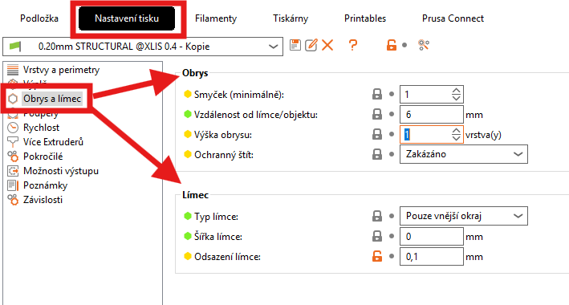{ width="600" }
    <figcaption>Nastavení obrysu a límce</figcaption>
</figure>

Čisticí věž je na tiskové podložce kvůli tomu, aby bylo možno zajistit ostré přechody barev a stabilní posun filamentu i po změně barvy. Využívá se tedy v případě multimateriálového (=barevného) tisku. Její nastavení nalezneme opět v záložce *Nastavení tisku* &rarr; *Více extruderů*.

<figure markdown>
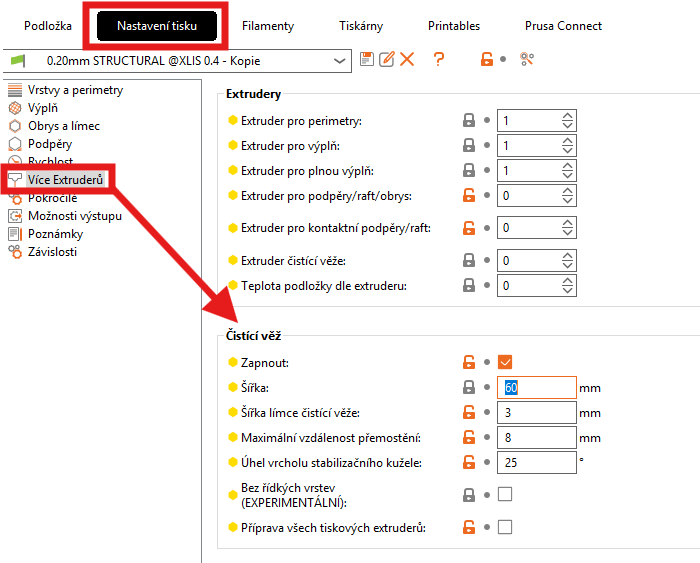{ width="600" }
    <figcaption>Nastavení čisticí věže</figcaption>
</figure>

Po slicování si můžeme zkontrolovat přidání nových parametrů tisku.

<figure markdown>
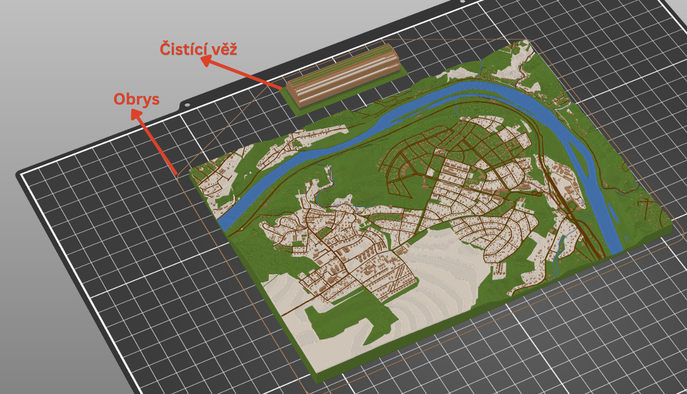{ width="800" }
    <figcaption>Ukázka obrysu a čisticí věže po vyslicování modelu</figcaption>
</figure>

### 7) Export modelu pro 3D tisk

Jestliže máme model připravený pro 3D tisk, existují dvě možnosti, jak jej exportovat do tiskárny:

- Wifi tisk, pro který je potřeba spárovat konkrétní 3D tiskárnu s PrusaSlicerem na počítači.

- Export ve formátu G-code, který do tiskárny přesuneme pomocí přenosného USB flash disku.

Po vyslicování modelu se zobrazí buď jedna nebo obě možnosti (dle předchozího párování s tiskárnou). V tomto případě využijeme možnosti Exportovat G-code. Soubor přesuneme na přenosný USB flash disk a následně jej vložíme do tiskárny manuálně.

<figure markdown>
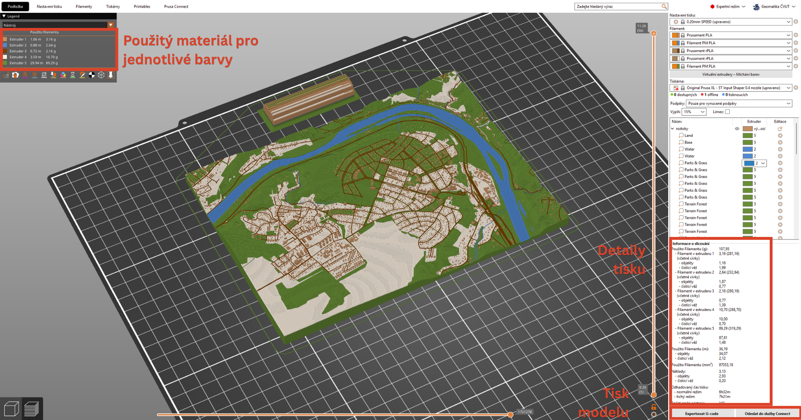{ width="1000" }
    <figcaption>Hotový model ve sliceru</figcaption>
</figure>

!!! tip "&nbsp;<span>Tip</span>"
    Při tvorbě vlastního rámečku např. ve SketchUpu je nutné počítat s přesností 3D tisku. Je tedy vhodné vnitřní prostor rámečku vytvořit např. o 0,5 mm větší vůči velikosti modelu terénu.

!!! warning "&nbsp;<span>Odevzdání úlohy</span>"
    Připravený projekt v PrusaSliceru ve tvaru **"prijmeni_jmeno_misto.3mf"** odešlete na mail ```frantisek.muzik@fsv.cvut.cz``` do **středy 2.12.2026** s informací, zda máte zájem o tisk fyzického modelu.

!!! note "&nbsp;<span>Další zajímavé informace</span>"
    - 7 věcí, které ovlivňují kvalitu tisku: <https://josefprusa.cz/7-veci-ktere-ovlivnuji-kvalitu-tisku/>

    - Obrys a límec: <https://help.prusa3d.com/cs/article/obrys-a-limec_133969>

    - Rafts, Skirts and Brims!: <https://www.simplify3d.com/resources/articles/rafts-skirts-and-brims/>

    - Čisticí věž: <https://help.prusa3d.com/cs/article/chytra-cistici-vez_125010>
