## [Prezentace](https://docs.google.com/presentation/d/1j0gdW9ONigroddMcLznmx1z6jKLW65LkUTh5pNDGOTg/edit?usp=sharing)

## Doporučená literatura

- Stříteský, O.&nbsp;a&nbsp;kol. (2021): [Základy 3D tisku s&nbsp;Josefem Průšou](https://is.muni.cz/el/ped/jaro2021/TI9009/111101390/zaklady-3d-tisku.pdf)

---------

Cílem úlohy je představení základů technologie 3D tisku metodou Fused Filament Fabrication (FFF), která je rozšířená v&nbsp;rámci cenově dostupných stolních tiskáren. Metoda je založena na nanášení roztaveného materiálu po tenkých vrstvách. Tato úloha pracuje s&nbsp;jednomateriálovým tiskem, tudíž model lze vytisknout na každé FFF 3D tiskárně.

## Co bude potřeba?

- **Objekt pro skenování** – ideálně vybereme **sochu**, kterou jsme schopni nasnímat ze všech stran (tedy i&nbsp;ze shora)

- **Mobilní aplikace pro 3D skenování** – zde si ukážeme postup v&nbsp;aplikaci **Scaniverse**. Případně lze použít také např. RealityScan.

- Počítačový software – volně dostupný **PrusaSlicer** (úlohu lze zpracovat v&nbsp;jakémkoliv jiném sliceru)

## 1) Nasnímání objektu

Vyhlédnutý objekt skenujeme při denním světle a&nbsp;dbáme na to, abychom při skenování neohrožovali sebe či ostatní (například vstupem do silnice). V&nbsp;této ukázce pracujeme se sochou gryfa, která se nachází před zámkem Mokrosuky na Sušicku.

<figure markdown>
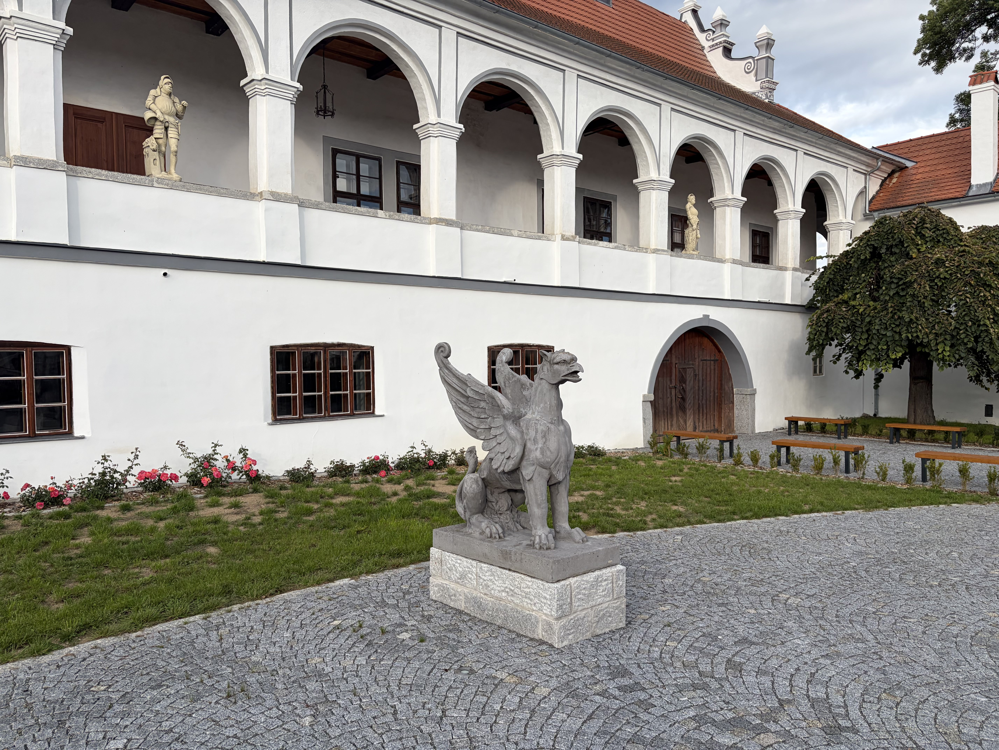{ width="600" }
    <figcaption>Pohled na sochu před skenováním</figcaption>
</figure>

Vybraný objekt nasnímáme pomocí mobilní aplikace pro 3D skenování Scaniverse.

Pomocí tlačítka + vytvoříme nový sken. Vybereme možnost Mesh a&nbsp;Medium Object, jestliže jsme vybrali sochu zhruba o&nbsp;lidské velikosti. Poté spustíme samotné snímání.

Při snímání je důležité:

- pohybovat se kolem objektu **pomalu**,

- snímat objekt **ze všech stran a&nbsp;z&nbsp;různých úhlů**,

- zajistit **dostatečný překryv snímků**.

Po dokončení snímání zvolíme typ zpracování **Detail** a&nbsp;poté proběhne automatické vytvoření 3D modelu objektu. Vytvořený model je vhodné **oříznout** (**Edit – Crop**), aby zůstal pouze samotný objekt bez širšího okolí.

Výsledný model poté **exportujeme** ve formátu **.stl (Share – STL)** a&nbsp;stáhneme si ho do počítače.

<figure markdown>
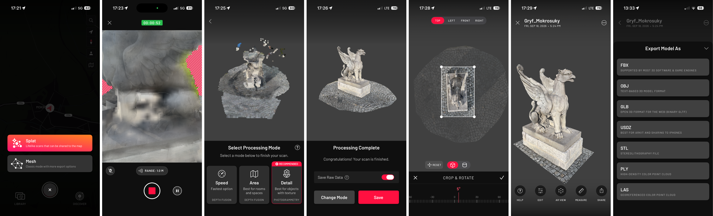{ width="1200" }
    <figcaption>Postup skenování a&nbsp;editace v&nbsp;aplikaci Scaniverse</figcaption>
</figure>

---------

## 2) Import 3D modelu a&nbsp;základní úpravy ve sliceru

[Testovací model gryfa :simple-printables:](https://www.printables.com/model/1851195-socha-gryfa-zamek-mokrosuky/files){ .md-button .md-button--primary }

!!! tip "&nbsp;Tip"
    Pokud využíváte testovací model gryfa, pak jej z webu Printables stáhněte ve formátu **.STL**. V tomto formátu je uložený samotný model. Celý projekt s nastavením v PrusaSliceru je dostupný jako soubor ve formátu .3mf.

Po úspěšném přesunu virtuálního 3D modelu na počítač se můžeme přesunout do **PrusaSliceru**. V&nbsp;této ukázce pracujeme s&nbsp;verzí 2.9.6. Slicer je software, ve kterém připravujeme modely pro 3D tisk a&nbsp;nastavujeme parametry tisku či použitý typ filamentu (materiálu).

3D model importujeme do sliceru přes **Soubor - Importovat - Importovat STL/3MF/STEP/OBJ/AMF**.

<figure markdown>
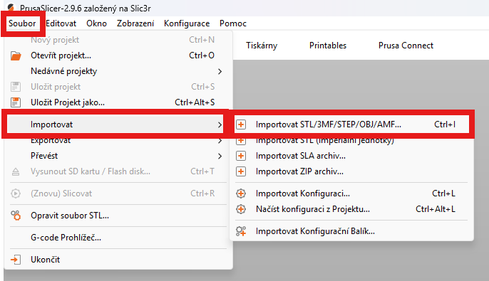{ width="600" }
    <figcaption>Import 3D modelu do PrusaSliceru</figcaption>
</figure>

Při importu modelu může vyskočit hláška upozorňující na nevhodně zvolené jednotky modelu. Necháme je přepočítat. Pokud bychom však chtěli fyzický 3D model vytisknout v&nbsp;určitém specifickém měřítku (např. 1&nbsp;:&nbsp;100), musíme si ohlídat přepočtenou velikost modelu. 

<figure markdown>
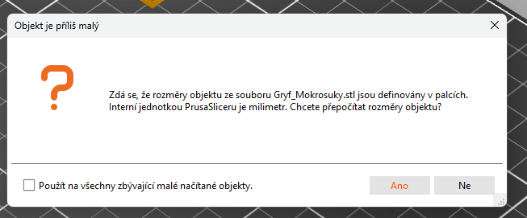{ width="600" }
    <figcaption>Přepočet jednotek při importu</figcaption>
</figure>

Nyní máme model ve sliceru, ale bude jej potřeba drobně upravit před odesláním k&nbsp;3D tisku. 

PrusaSlicer má velmi rozsáhlé možnosti nastavení, nicméně v&nbsp;této úloze budeme používat pouze základní funkce softwaru. Ty jsou dostupné z&nbsp;nabídky v&nbsp;levé části obrazovky:

- **Přesunout** - posouvání objektu po tiskové podložce

- **Měřítko** - změna velikosti objektu

- **Otočit** - otočení objektu v&nbsp;osách X, Y, Z

- **Umístit plochou na podložku** - výběr plochy, která bude na tiskové podložce (místo ručního otáčení objektu)

- **Řezat** - rozdělení modelu na části (lze využít, když je model moc velký, potřebujeme nějakou část smazat nebo chceme přidat konektory)

- **Malování podpěr** - přidání podpěr pro podepření převisů v&nbsp;modelu

- **Multimateriálové malování** - obarvení modelu při použití multimateriálového tisku

- **Měření** - pravítko pro měření rozměrů částí modelu

!!! tip "&nbsp;Tip"
    Pro editaci objektu jej musíme vždy vybrat levým tlačítkem myši.

Model si otočíme dle potřeby. Buď funkcí **Otočit**, ale vhodnější je **Umístit plochou na podložku**. Tato funkce totiž zajistí automaticky vhodný úhel natočení modelu. Při vybrání funkce se nám na modelu zobrazí dostupné plošky, na základě kterých můžeme model otočit. Vybereme plochu na spodní straně modelu.

<figure markdown>
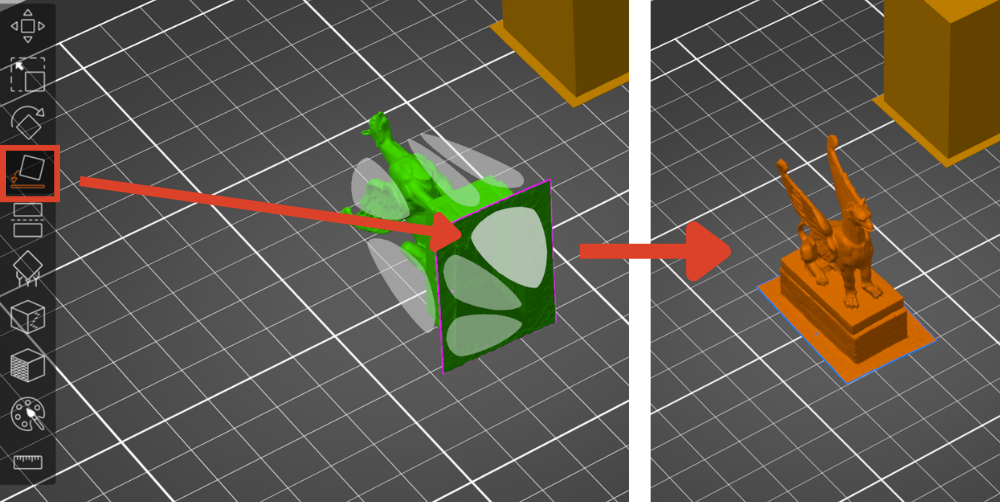{ width="800" }
    <figcaption>Otočení modelu dle potřeby</figcaption>
</figure>

Pokud je potřeba, můžeme model oříznout funkcí **Řezat**, čímž se lze zbavit přebytečných částí modelu, které jsme neoříznuli v&nbsp;předchozím zpracování. Pomocí myši posuneme nebo případně natočíme rovinu řezu. Úpravy provedeme tlačítkem **Provést řez**. Model se takto rozdělí na dvě části, přičemž tu nechtěnou můžeme označit levým tlačítkem a&nbsp;smazat. V&nbsp;případě potřeby lze přidat i&nbsp;konektory, které slouží pro spojení dvou rozříznutých částí. Tato funkce se hodí například u&nbsp;rozložitelných modelů. Nyní ji však nevyužijeme.

!!! tip "&nbsp;Tip"
    Po potvrzení řezu můžeme být programem dotázáni na opravu otevřených hran nebo chyb. Ve většině případů je dobré nechat tyto problémy opravit, neboť předejdeme řadě problémům s&nbsp;výstiskem.

<figure markdown>
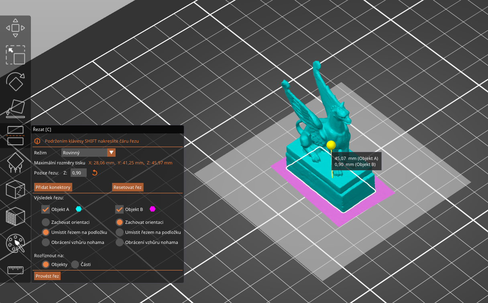{ width="800" }
    <figcaption>Oříznutí nadbytečné části modelu</figcaption>
</figure>

Model můžeme zmenšit či zvětšit do různého měřítka. V&nbsp;základním nastavení má model použitý v&nbsp;této ukázce rozměry 33x17x45&nbsp;mm. Velikost modelu můžeme buď změnit ručně funkcí **Měřítko** nebo přes panel **Manipulace s&nbsp;objektem** zadat požadované hodnoty. 

Pro odhad velikosti můžeme využít čtvercové sítě na virtuální tiskové podložce v&nbsp;PrusaSliceru. Každý čtverec má délku strany 10&nbsp;mm.

<figure markdown>
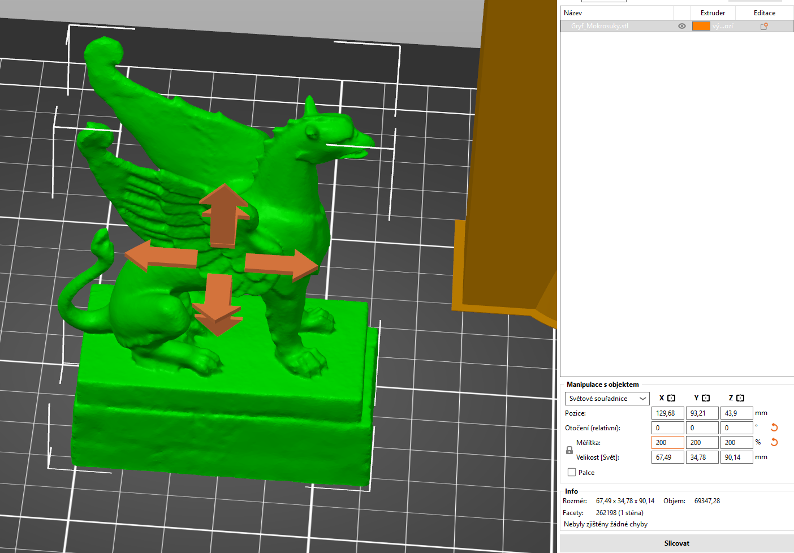{ width="800" }
    <figcaption>Změna velikosti modelu</figcaption>
</figure>

---------

## 3) Nastavení parametrů tisku

3D model máme nyní připravený, avšak musíme ještě nastavit několik parametrů tisku:

- výběr správné tiskárny a&nbsp;nastavení tisku

- použitý materiál (filament)

- nastavení tiskových podpěr

#### Výběr správné tiskárny, nastavení tisku a&nbsp;výběr materiálu

V&nbsp;pravé horní části hlavní obrazovky můžeme vybrat základní profil tisku v&nbsp;sekci **Nastavení tisku**. Profily se liší zejména ve výšce vrstvy a&nbsp;v&nbsp;rychlosti tisku. Vybereme výšku 0,2&nbsp;mm BALANCED, což je profil vhodný pro většinu výstisků. Pokud bychom chtěli zajistit větší detail, můžeme zvolit menší výšku vrstvy. 

Níže se nachází sekce pro výběr tiskového materiálu - nastavíme **filament** dle reálného materiálu, který používáme. V&nbsp;tomto případě Buddy3D PLA. 

Třetí položkou v&nbsp;celé sekci je **Tiskárna**, kde vybereme konkrétní tiskárnu včetně volby správného průměru trysky (0,4&nbsp;mm).

!!! tip "&nbsp;Tip"
    Pokročilé možnosti nastavení tisku se nacházejí v&nbsp;záložkách **Nastavení tisku, Filamenty a&nbsp;Tiskárny** v&nbsp;levé horní části programu.

<figure markdown>
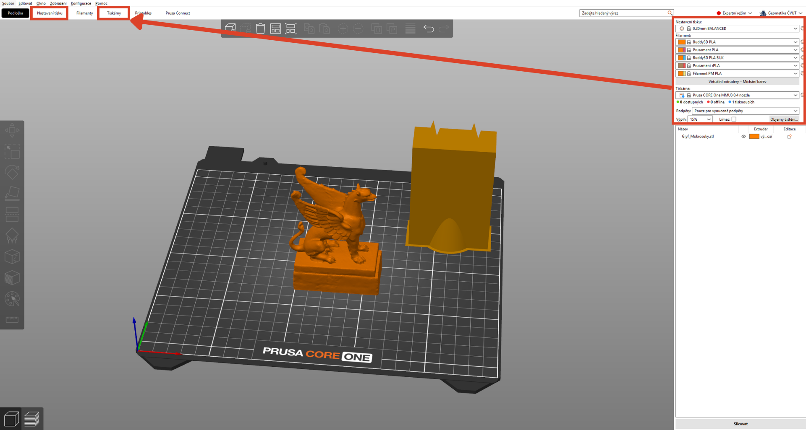{ width="1200" }
    <figcaption>Nastavení tisku</figcaption>
</figure>

#### Nastavení tiskových podpěr

Pokud bychom nyní dali model tisknout, mohlo by se stát, že část modelu se vytiskne chybně, vzhledem k&nbsp;velkým převisům. Ve zkratce by to znamenalo, že tiskárna by se pokoušela tisknout "do vzduchu" bez jakéhokoliv nebo velmi malého podkladu. Problematická místa můžeme vizuálně objevit po slicování modelu (tlačítkem vpravo dole).

<figure markdown>
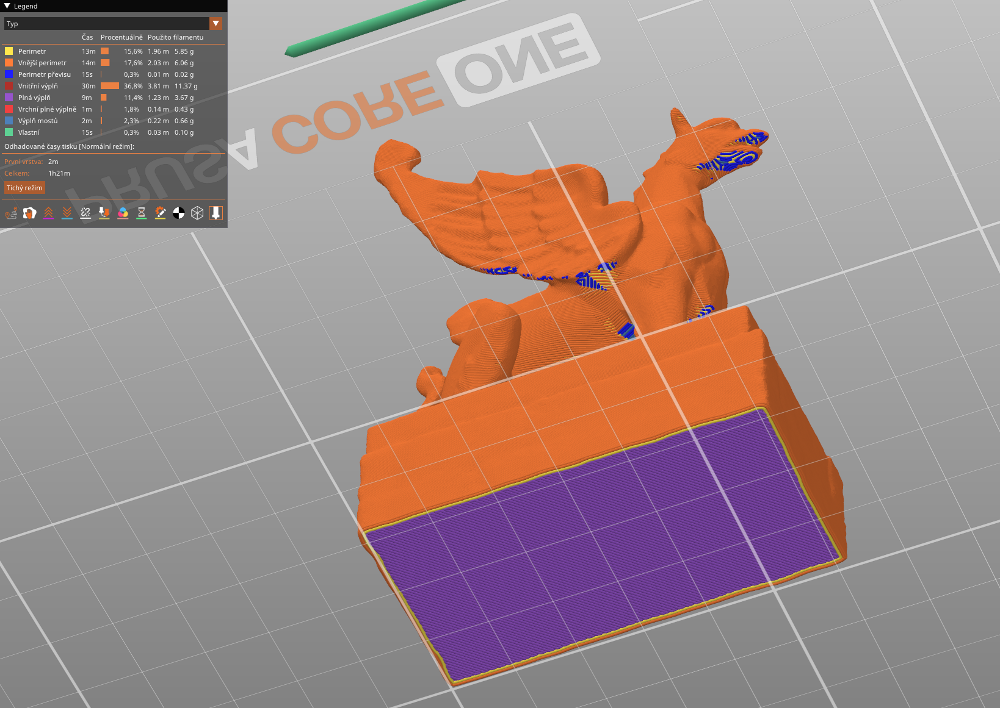{ width="600" }
    <figcaption>Pohled ze spodu vyslicovaného modelu na místa s&nbsp;převisem (modře), pod které by bylo vhodné doplnit podpěry.</figcaption>
</figure>

Podpěry můžeme nastavit automatizovaně na základě detekovaných převisů, což je nejrychlejší způsob, který však umístí podpěry i&nbsp;na nepotřebná místa. Výsledkem je větší spotřeba materiálu a&nbsp;delší doba tisku. Druhou možností je ruční kreslení podpěr. Vybereme model levým tlačítkem myši a&nbsp;v&nbsp;levé části obrazovky zvolíme funkci **Malování podpěr**.

Nastavíme **Zvýraznění převisu podle úhlu** na hodnotu 30, čímž vyfiltrujeme místa, kde by mohla mít tiskárna reálně problém. Dále zapneme **Chytré vybarvení** a&nbsp;vykreslení **Pouze na převisech**. Levým tlačítkem myši pak vybíráme světle modrá místa, kde se dokreslí podpěry. Pokud jsme s&nbsp;malováním podpěr spokojení, můžeme vpravo dole **Slicovat**.

<figure markdown>
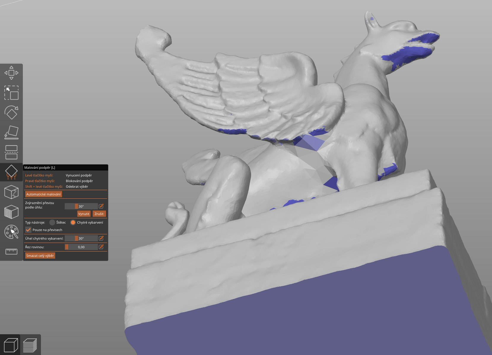{ width="600" }
    <figcaption>Manuální malování podpěr</figcaption>
</figure>

V&nbsp;základním nastavení se v&nbsp;modelu vytvoří přiléhavé podpěry. Pro komplexní objekty jsou však vhodnější **organické podpěry**. 

<figure markdown>
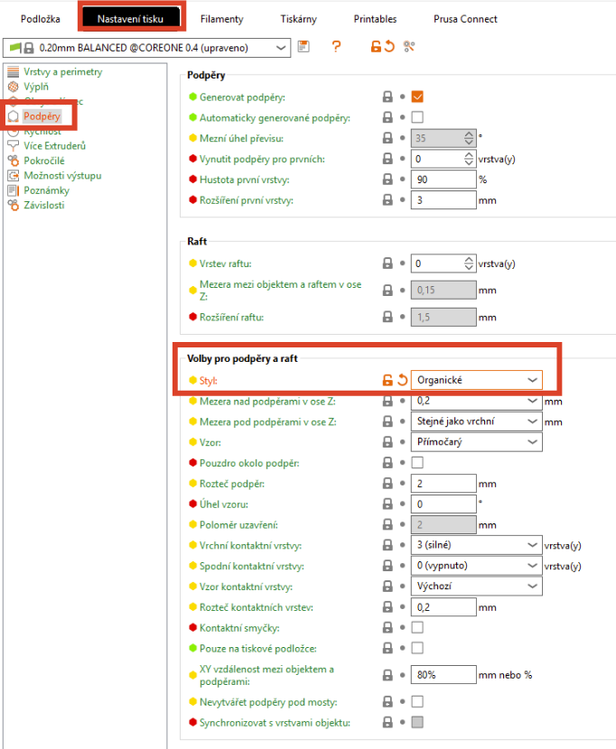{ width="400" }
    <figcaption>Změna typu podpěr</figcaption>
</figure>

Níže je vidět porovnání různých nastavení podpěr. Model gryfa můžeme vytisknout buď s&nbsp;použitím organických podpěr v&nbsp;základním nastavení nebo s&nbsp;možností položení podpěr pouze na podložce.

<figure markdown>
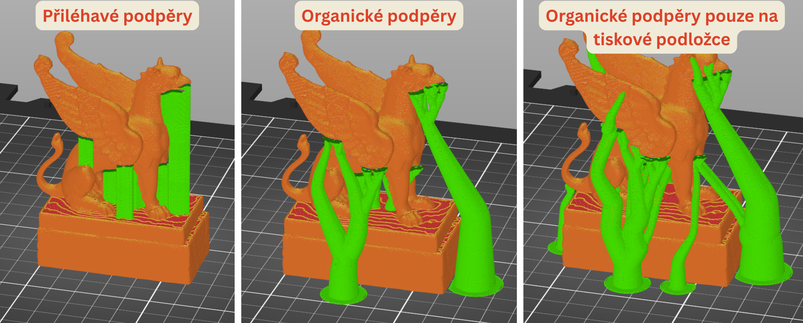{ width="800" }
    <figcaption>Základní typy podpěr</figcaption>
</figure>

Jestliže jsme s&nbsp;připraveným modelem spokojeni, můžeme jej poslat na tisk tlačítkem vpravo **Exportovat G-code/Odeslat do služby Connect**.

---------

## 4) Úprava vytištěného modelu

Hotový fyzický 3D model je potřeba očistit od podpěr či stringů (tenkých vláken filamentu, které vznikají nejčastěji při použití nevysušeného filamentu). Na očištění modelu jsou vhodné malé kleště a&nbsp;zalamovací nůž, přičemž je nutné pracovat **VELMI OPATRNĚ, abychom předešli pořezání prstů**. Zároveň je nutné brát v&nbsp;potaz křehkost modelu. Při nešikovné manipulaci můžeme omylem ulomit místo podpěry také část modelu. Ulomené části jdou velmi dobře dolepit s&nbsp;použitím modelářského lepidla.

<figure markdown>
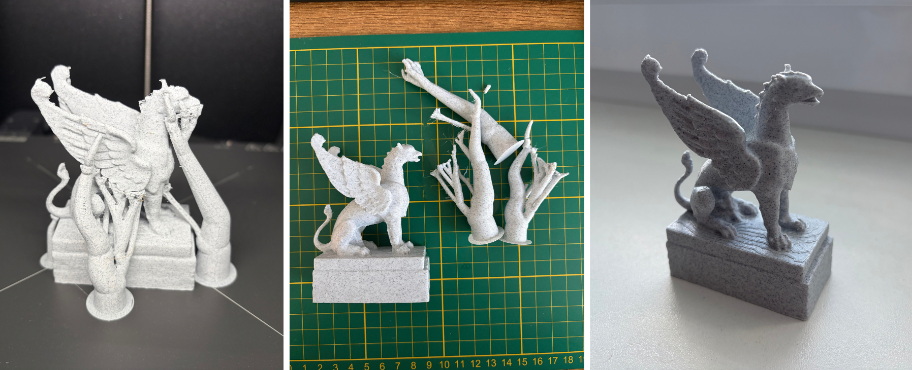{ width="1000" }
    <figcaption>Výsledný fyzický 3D model gryfa před a&nbsp;po odstranění podpěr</figcaption>
</figure>

???+ note "&nbsp;Užitečné odkazy"
    - Jak vytisknout svět nejen okolo nás na 3D tiskárně: <https://blog.prusa3d.com/cs/jak-vytisknout-svet-nejen-okolo-nas-na-3d-tiskarne_29117/>
    
    - 3D Printing and Photogrammetry: <https://www.pix-pro.com/blog/3d-printing>

    - How to 3D Print GIS Data from Global Mapper: <https://www.bluemarblegeo.com/blog/how-to-3d-print-gis-data-from-global-mapper/>

    - 3D tisk UPOL: <https://www.geoinformatics.upol.cz/veda-vyzkum/3d-tisk/>

    - Hmatové mapy: <https://hmatovemapy.upol.cz/vystupy-projektu/>

    - How to Design 3D Population Maps Using Tinkercad: <https://www.tinkercad.com/projects/How-to-Design-3D-Population-Maps-Using-Tinkercad>
    
    - How To Use RealityScan: <https://youtu.be/HVkvHZCmVjU?si=L629gyrV5xjFkjMu>

    - model totální stanice: <https://cults3d.com/en/3d-model/art/leica-total-station-ms60-kit-to-assemble>

    - TouchTerrain: <https://touchterrain.geol.iastate.edu/main>

    - TouchMapper: <https://touch-mapper.org/en/area>