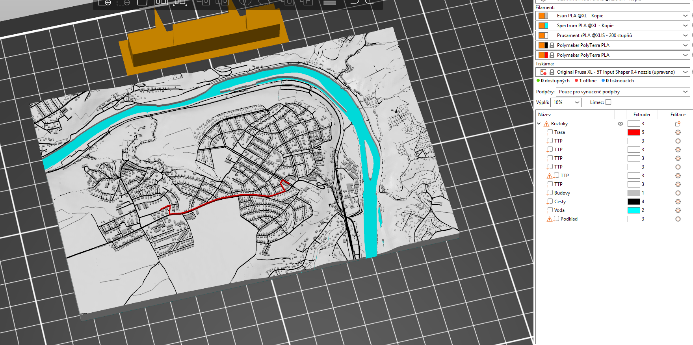
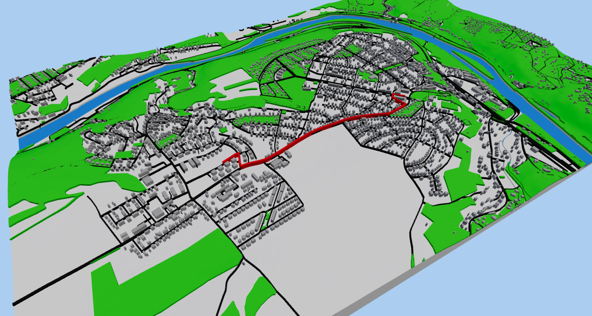

# Vizualizace 3D modelů pomocí moderních technologií {: .page_title}

Tento povinně-volitelný předmět představuje možnosti vizualizace trojrozměrných modelů pomocí moderních technologií.

Postupně se představí několik různých způsobů zpracování a vizualizace 3D prostorových dat, a to fotogrammetrických, GIS či kartografických. První část předmětu se soustředí na představení herního enginu Unreal Engine, ve kterém lze vizualizovat fotogrammetrická data v prostředí virtuální reality. Následuje ukázka práce s 3D GIS daty v ArcGIS Pro a ArcGIS Online. Tyto znalosti budou rozvíjeny základy procedurálního modelování s využitím softwaru City Engine. Dále budou představeny možnosti 3D tisku prostorových GIS dat. Závěrem semestru se pak přesuneme k vizualizaci geodat v rozšířené realitě, a to jak ve webovém prohlížeči, tak s využitím dedikované mobilní aplikace vyvinuté pomocí herního enginu Unity.

<h2 style="text-align:center;">Naučíte se</h2>
<!-- styl je zde pridany HTML tagem (ne pomoci '##'), aby se text neobjevil v tabulce obsahu vlevo na strance -->

 <!-- specificky format gridu (trida "grid_icon_info") na miru uvodni strance predmetu -->

-   :simple-unrealengine:{ .xl }

    pracovat s __Unreal Engine__

-   :fontawesome-solid-vr-cardboard:{ .xl }

    zobrazit data ve __virtuální realitě__

-   :fontawesome-solid-photo-film:{ .xl }

    pokročilou tvorbu a editaci __fotogrammetrických__ modelů

-   :simple-materialdesignicons:{ .xl }

    psát __CGA__ kód a generovat __procedurální__ krajinu nebo města

-   :material-printer-3d-nozzle:{ .xl }

    připravit prostorová data pro __3D tisk__

-   :simple-unity:{ .xl }

    vytvořit __mobilní aplikaci__ pomocí herního enginu __Unity__

-   :simple-arcgis:{ .xl }

    pracovat s __3D GIS__ daty v ArcGIS Pro a ArcGIS Online

-   :material-augmented-reality:{ .xl }

    vizualizovat prostorová data v prostředí __rozšířené reality__

{: .no-filter }
{: .no-filter }
{: .no-filter }
{: .no-filter }
{: .no-filter }
{: .no-filter }
{: .no-filter }

## Harmonogram {: style="margin-bottom:0;"}

{: .off-glb .no-filter style="height: 1.5em; vertical-align: -.4em; clip-path: circle();"}
__[Ing. Karel Pavelka, Ph.D.](https://geomatics.fsv.cvut.cz/employees/karel-pavelka-ml/) [:fontawesome-solid-square-envelope:](mailto:karel.pavelka@cvut.cz "karel.pavelka@cvut.cz"){style="color:var(--md-default-fg-color);"}__{style="padding-right:1rem;"}
{style="display:inline; white-space: nowrap; line-height:2;"}
<!-- kvuli zobrazovani na mobilu -->

{: .off-glb .no-filter style="height: 1.5em; vertical-align: -.4em; clip-path: circle();"}
__[Ing. Vojtěch Cehák](https://geomatics.fsv.cvut.cz/employees/vojtech-cehak/) [:fontawesome-solid-square-envelope:](mailto:vojtech.cehak@fsv.cvut.cz "vojtech.cehak@fsv.cvut.cz"){style="color:var(--md-default-fg-color);"}__{style="padding-right:1rem;"}
{style="display:inline; white-space: nowrap; line-height:2;"}
<!-- kvuli zobrazovani na mobilu -->

{: .off-glb .no-filter style="height: 1.5em; vertical-align: -.4em; clip-path: circle();"}
__[Ing. Michal Janovský, PhD.](https://geomatics.fsv.cvut.cz/employees/michal-janovsky/) [:fontawesome-solid-square-envelope:](mailto:michal.janovsky@fsv.cvut.cz "michal.janovsky@fsv.cvut.cz"){style="color:var(--md-default-fg-color);"}__{style="padding-right:1rem;"}
{style="display:inline; white-space: nowrap; line-height:2;"}
<!-- kvuli zobrazovani na mobilu -->

{: .off-glb .no-filter style="height: 1.5em; vertical-align: -.4em; clip-path: circle();"}
__[Ing. František Mužík](https://geomatics.fsv.cvut.cz/employees/frantisek-muzik/) [:fontawesome-solid-square-envelope:](mailto:frantisek.muzik@fsv.cvut.cz "frantisek.muzik@fsv.cvut.cz"){style="color:var(--md-default-fg-color);"}__{style="padding-right:1rem;"}
{style="display:inline; white-space: nowrap; line-height:2;"}
<!-- kvuli zobrazovani na mobilu -->

<!--
1. Představení možností vizualizace 3D prostorových dat moderními technologiemi. Základy 3D tisku. 
2. 3D tisk prostorových dat. Ukázka pokročilejších možností 3D tisku včetně vícebarevného tisku.
3. Práce s 3D GIS daty v ArcGIS Pro. Publikace a správa trojrozměrných dat na ArcGIS Online.
4. Seznámení s procedurálním modelováním. Základy City Engine a psaní CGA kódu.
5. Základy Unreal Engine. Seznámení s uživatelským prostředím.
6. Představení virtuální reality. Příprava 3D modelů pro virtuální realitu.
7. Pokročilé editace fotogtammetrických modelů. Moderní metody ve fotogrammetrii.
8. Vizualizace 3D dat ve virtuální realitě.
9. Pokročilejší vizualizace v UE.
10. Představení rozšířené reality. WebXR, webové JS knihovny.
11. Využití herního enginu Unity. Tvorba mobilní aplikace pro Android v Unity.
-->

Harmonogram je platný pro zimní semestr 2026/27.
{: style="opacity:50%;margin-top:0;"}

Výuka je vedena formou workshopu, přičemž přednášky bezprostředně předcházejí cvičením, s nimiž se mnohdy prolínají.
{: style="opacity:50%;margin-top:0;"}

<table style="border-collapse:collapse; width:100%; font-family:Arial,sans-serif; font-size:14px;">
  <thead>
    <tr style="background:#ebae20; color:#fff;">
      <th style="padding:8px 12px; text-align:center;">Týden</th>
      <th style="padding:8px 12px; text-align:center;">Datum</th>
      <th style="padding:8px 12px;">Téma</th>
      <th style="padding:8px 12px; text-align:center;">Vyučující</th>
    </tr>
  </thead>
  <tbody>
    <tr style="border-top:2px solid #aaa;">
      <td style="text-align:center; font-weight:bold; padding:8px 12px;">1</td>
      <td style="text-align:center; padding:8px 12px;">24.09.2026</td>
      <td style="padding:8px 12px;">Úvod do problematiky zpracování a reprezentace 3D modelů</td>
      <td style="text-align:center; padding:8px 12px;">Karel Pavelka</td>
    </tr>
    <tr style="border-top:2px solid #aaa;">
      <td style="text-align:center; font-weight:bold; padding:8px 12px;">2</td>
      <td style="text-align:center; padding:8px 12px;">01.10.2026</td>
      <td style="padding:8px 12px;">Úvod do Unreal Engine 5</td>
      <td style="text-align:center; padding:8px 12px;">Karel Pavelka</td>
    </tr>
    <tr style="border-top:2px solid #aaa;">
      <td style="text-align:center; font-weight:bold; padding:8px 12px;">3</td>
      <td style="text-align:center; padding:8px 12px;">08.10.2026</td>
      <td style="padding:8px 12px;">Pokročilé práce v Unreal Engine 5</td>
      <td style="text-align:center; padding:8px 12px;">Karel Pavelka</td>
    </tr>
    <tr style="border-top:2px solid #aaa;">
      <td style="text-align:center; font-weight:bold; padding:8px 12px;">4</td>
      <td style="text-align:center; padding:8px 12px;">15.10.2026</td>
      <td style="padding:8px 12px;">Další možnosti vizualizace 3D objektů</td>
      <td style="text-align:center; padding:8px 12px;">Karel Pavelka</td>
    </tr>
    <tr style="border-top:2px solid #aaa;">
      <td style="text-align:center; font-weight:bold; padding:8px 12px;">5</td>
      <td style="text-align:center; padding:8px 12px;">22.10.2026</td>
      <td style="padding:8px 12px;">Úvod do 3D GIS</td>
      <td style="text-align:center; padding:8px 12px;">Vojtěch Cehák</td>
    </tr>
    <tr style="border-top:2px solid #aaa;">
      <td style="text-align:center; font-weight:bold; padding:8px 12px;">6</td>
      <td style="text-align:center; padding:8px 12px;">29.10.2026</td>
      <td style="padding:8px 12px;">Úvod do procedurálního modelování</td>
      <td style="text-align:center; padding:8px 12px;">Vojtěch Cehák, Michal Janovský</td>
    </tr>
    <tr style="border-top:2px solid #aaa;">
      <td style="text-align:center; font-weight:bold; padding:8px 12px;">7</td>
      <td style="text-align:center; padding:8px 12px;">05.11.2026</td>
      <td style="padding:8px 12px;">Práce s rastry, procedurální generování vegetace v Unreal Engine</td>
      <td style="text-align:center; padding:8px 12px;">Michal Janovský</td>
    </tr>
    <tr style="border-top:2px solid #aaa;">
      <td style="text-align:center; font-weight:bold; padding:8px 12px;">8</td>
      <td style="text-align:center; padding:8px 12px;">12.11.2026</td>
      <td style="padding:8px 12px;">Úvod do 3D tisku. Základní principy a jednobarevný tisk</td>
      <td style="text-align:center; padding:8px 12px;">František Mužík</td>
    </tr>
    <tr style="border-top:2px solid #aaa;">
      <td style="text-align:center; font-weight:bold; padding:8px 12px;">9</td>
      <td style="text-align:center; padding:8px 12px;">19.11.2026</td>
      <td style="padding:8px 12px;">Změna v rozvrhu - výuka jako v PONDĚLÍ SUDÉHO týdne</td>
      <td style="text-align:center; padding:8px 12px;"></td>
    </tr>
    <tr style="border-top:2px solid #aaa;">
      <td style="text-align:center; font-weight:bold; padding:8px 12px;">10</td>
      <td style="text-align:center; padding:8px 12px;">26.11.2026</td>
      <td style="padding:8px 12px;">Barevný tisk. Tisk 3D modelu mapy města</td>
      <td style="text-align:center; padding:8px 12px;">František Mužík</td>
    </tr>
    <tr style="border-top:2px solid #aaa;">
      <td style="text-align:center; font-weight:bold; padding:8px 12px;">11</td>
      <td style="text-align:center; padding:8px 12px;">03.12.2026</td>
      <td style="padding:8px 12px;">Úvod do Unity. Markerless a marker-based AR</td>
      <td style="text-align:center; padding:8px 12px;">František Mužík</td>
    </tr>
    <tr style="border-top:2px solid #aaa;">
      <td style="text-align:center; font-weight:bold; padding:8px 12px;">12</td>
      <td style="text-align:center; padding:8px 12px;">10.12.2026</td>
      <td style="padding:8px 12px;">Tvorba mobilní aplikace s geolokalizovanou AR</td>
      <td style="text-align:center; padding:8px 12px;">František Mužík</td>
    </tr>
    <tr style="border-top:2px solid #aaa; border-bottom:2px solid #aaa;">
      <td style="text-align:center; font-weight:bold; padding:8px 12px;">13</td>
      <td style="text-align:center; padding:8px 12px;">17.12.2026</td>
      <td style="padding:8px 12px;">Zápočet</td>
      <td style="text-align:center; padding:8px 12px;">Karel Pavelka</td>
    </tr>
  </tbody>
</table>

<!--
[{.off-glb .no-filter}](https://kos.cvut.cz/schedule/course/1551GIS/semester/B232){target="_blank"}
[{.off-glb .no-filter}](https://kos.cvut.cz/schedule/course/1551GIS/semester/B232){target="_blank"}

---

[Stránka předmětu v :custom-kos-logo-img-BW:{.middle style="margin-left:3px;"} :custom-kos-logo-BW:{.xl .middle}](https://kos.cvut.cz/course-syllabus/1551GIS/B232){ .md-button .md-button--primary target="_blank"}
{align=center}

-->